# Especificação Técnica Completa — Refatoração Saúde Financeira

> **Versão**: 1.1  
> **Data**: 2026-07-20  
> **Tipo**: Spec-Driven Development (SDD)  
> **Status**: Aprovado

---

## Resumo Executivo

Este documento especifica a refatoração completa da aplicação **Saúde Financeira** — atualmente uma SPA (Single Page Application) inteiramente client-side com persistência em LocalStorage/CSV — para uma arquitetura **cliente-servidor** com backend em **Go**, banco de dados **PostgreSQL** e orquestração via **Docker Compose**.

### Decisões Resolvidas

| Questão | Decisão |
|---------|---------|
| OQ-1 — LLM Proxy | Chamadas LLM passam pelo backend Go (protege API keys) |
| OQ-2 — Fotos de Metas | Híbrido: uploads salvos em disco, URLs salvas no PostgreSQL |
| OQ-3 — Chat History | Não persistir na V1 (mantém comportamento atual em memória) |

### Principais Decisões Arquiteturais

| Decisão | Justificativa |
|---------|---------------|
| Go + Clean Architecture | Separação de responsabilidades, testabilidade, tipagem forte, performance nativa |
| PostgreSQL | ACID compliance, suporte a JSON, indexação avançada, extensibilidade |
| Docker Compose (3 containers) | Ambiente reproduzível, isolamento, deploy simplificado |
| API REST com versionamento `/api/v1` | Evolução controlada, compatibilidade retroativa |
| Frontend como thin client | Minimizar mudanças visuais, preservar UX idêntica |
| Cálculos permanecem no frontend | Evitar latência em operações de renderização; backend valida na escrita |
| LLM proxy no backend | API keys protegidas, logs centralizados, rate limiting futuro |
| Fotos híbridas (disco + DB) | Flexibilidade: upload binário vai para disco, URL externa fica no campo texto do banco |

### Benefícios Esperados

- **Persistência confiável**: Dados em PostgreSQL com backup, restore, transações ACID
- **Segurança**: API keys da LLM nunca expostas no client-side
- **Escalabilidade futura**: Autenticação, multi-usuário, sincronização entre dispositivos
- **Testabilidade**: Backend testável isoladamente via unit/integration tests
- **Portabilidade**: Execução em qualquer máquina com Docker instalado
- **Manutenibilidade**: Separação clara de responsabilidades entre frontend e backend

### Riscos Identificados

| Risco | Severidade | Mitigação |
|-------|-----------|-----------|
| Divergência de lógica frontend↔backend | Alta | Manter cálculos no frontend, backend apenas persiste e valida |
| Perda de dados na migração CSV/LocalStorage→PostgreSQL | Alta | Script de migração com validação + rollback |
| Latência introduzida pela rede | Média | Cache local, optimistic updates, batch requests |
| Complexidade do Docker para usuários não-técnicos | Baixa | `docker compose up` único comando |

### Estimativa de Complexidade por Fase

| Fase | Complexidade | Esforço Estimado |
|------|-------------|-----------------|
| 1 — Análise | Baixa | 1 dia |
| 2 — Arquitetura | Média | 1 dia |
| 3 — Modelagem Banco | Média | 1-2 dias |
| 4 — Backend | Alta | 5-7 dias |
| 5 — Frontend | Média | 3-4 dias |
| 6 — API | Alta | 3-4 dias |
| 7 — Migração | Média | 2 dias |
| 8 — Docker | Baixa | 1 dia |
| 9 — Testes | Alta | 3-4 dias |
| 10 — Roadmap | Baixa | 1 dia |

---

# Fase 1 — Análise do Sistema Atual

## 1.1 Inventário de Funcionalidades

### Módulo de Perfis (FEAT-001)
- Criação de múltiplos perfis financeiros (nome + salário base)
- Seleção de perfil ativo
- Remoção de perfil com cascade (despesas, financiamentos, metas)
- Edição inline do salário
- Campo FGTS por perfil
- Campo `metaBaseline` (baseline acumulado para metas)

### Módulo de Despesas (FEAT-003, FEAT-004, FEAT-005)
- CRUD completo de despesas
- Tipos: Única, Recorrente, Parcelada (Cartão de Crédito)
- Categorias com cores customizáveis
- Subcategorias de investimento (CDB, Previdência, Fundos, Ações, Poupança, FGTS, Outros)
- Vínculo opcional com financiamento (`financiamentoId`) para amortizações
- Cálculo de custo em "horas de trabalho"
- Importação em lote via PDF (faturas de cartão)

### Módulo de Financiamentos (FEAT-006, FEAT-007)
- CRUD de contratos de financiamento
- Sistemas SAC e Price
- Cálculo de taxa implícita via Newton-Raphson
- Simulador de amortização extra (valor + frequência)
- Timeline mês-a-mês com saldo devedor, juros, amortização
- Integração com despesas de amortização

### Módulo de Investimentos (FEAT-NEW)
- Visualização de aportes por subcategoria
- Edição de saldo FGTS
- Cálculo de reserva de emergência ideal (6x gastos recorrentes + financiamentos)
- Indicador de saúde (verde/amarelo/vermelho)
- Gráficos por subcategoria

### Módulo de Metas (FEAT-NEW)
- CRUD de metas de compra com foto (upload ou URL)
- Priorização por drag-and-drop
- Sistema de "desbloqueio" baseado em investimentos acumulados
- Compra de meta (marca como `comprado`, ajusta baseline)
- Reordenação com recálculo automático de targets
- Ajuste de targets via LLM

### Módulo de Relatórios (FEAT-008, FEAT-009, FEAT-010, FEAT-011)
- Dashboard com resumo mensal e anual
- Gráfico donut por categoria (gastos)
- Gráfico de linha de projeção de cartão de crédito
- Comparação mês-a-mês com insights textuais
- Planejador financeiro com 4 métodos (Conservador, Equilibrado, Agressivo, Personalizado)

### Módulo de Configurações (FEAT-012, FEAT-013, FEAT-014)
- Tema claro/escuro
- CRUD de categorias com cor hexadecimal
- Subcategorias de investimento customizáveis
- Configuração de limites percentuais por método de planejamento
- Configuração de LLM (URL, API Key, Model, MaxContext)

### Módulo CSV (FEAT-015, FEAT-016)
- Exportação CSV por perfil
- Importação incremental com merge inteligente (upsert por perfil)
- Auto-detecção de delimitador (`,` ou `;`)
- Formato: `perfil,salario_base,tipo_registro,descricao,valor,categoria,mes_inicio,ano_inicio,parcelas,recorrente,valor_parcela,taxa_tr`

### Módulo IA/LLM (FEAT-017, FEAT-NEW)

Atualmente o frontend faz chamadas diretas à API da LLM. Na refatoração, **todas as chamadas LLM passam pelo backend Go** como proxy.

Funcionalidades LLM:
- Chat com agente financeiro inteligente
- Análise financeira automatizada
- Plano de economia
- Análise de investimentos
- Plano de amortização
- Método personalizado de planejamento
- Ajuste de metas targets
- Importação de despesas via PDF + LLM
- Ações do agente: criar/editar/remover despesas via chat

Chamadas LLM no código atual (7 pontos de fetch para LLM API):
1. `ui-agent.js:348` — Parsing de PDF (importação de fatura)
2. `ui-agent.js:689` — Chat com agente financeiro
3. `ui-agent.js:805` — Análise de investimentos
4. `ui-agent.js:949` — Plano de economia
5. `ui-agent.js:1140` — Análise financeira
6. `ui-agent.js:1236` — Plano de amortização
7. `ui-agent.js:1301` — Método personalizado
8. `ui-metas.js:253` — Ajuste de metas targets

Prompts carregados via fetch de arquivos estáticos:
- `prompts/importacao.md`
- `prompts/agente.md`
- `prompts/analise_investimentos.md`
- `prompts/plano_economia.md`
- `prompts/analise.md`
- `prompts/plano_amortizacao.md`
- `prompts/metodo_personalizado.md`
- `prompts/ajustar_meta.md`

### Gamificação — Financial Score
- Pontuação de 0 a ~1000 baseada em 7 dimensões
- Disciplina, Patrimônio, Liquidez, Concentração, Taxa de Essenciais, Taxa de Poupança, Gestão de Dívida

---

## 1.2 Mapeamento de Entidades

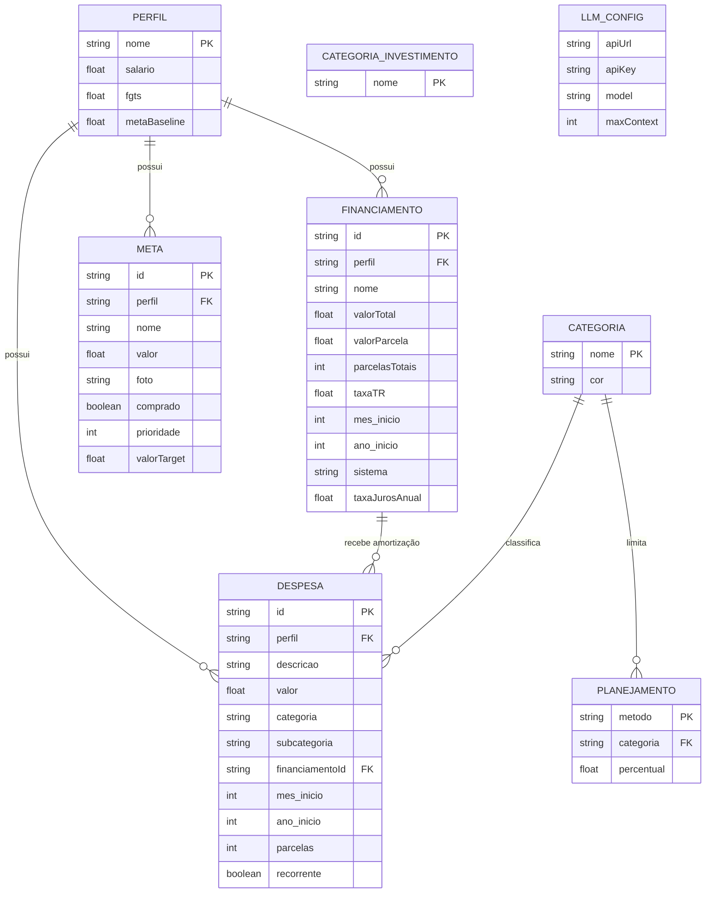

## 1.3 Fluxos de Dados Atuais

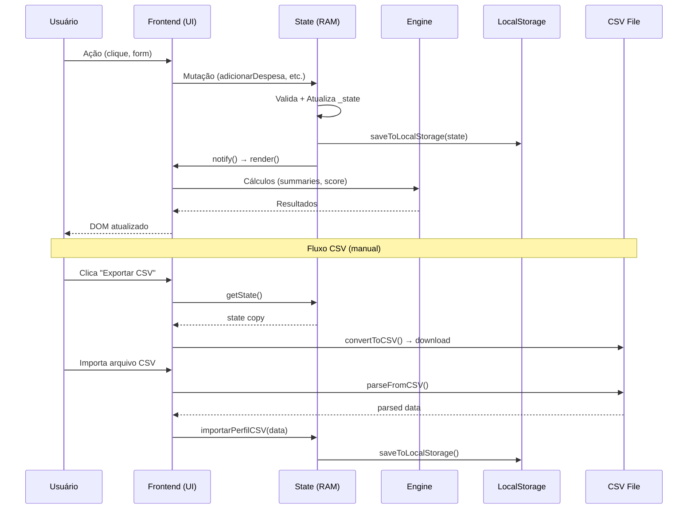

## 1.4 Persistência Atual

### LocalStorage
- **Chave única**: `saude_financeira_db`
- **Formato**: JSON stringified do objeto `_state` completo
- **Tamanho típico**: < 5MB (limite do navegador)
- **Frequência de escrita**: A cada mutação de estado (observer pattern)

### CSV
- **Uso**: Backup manual e importação incremental
- **Escopo**: Filtrado por perfil na exportação
- **Merge**: Upsert — sobrescreve despesas/financiamentos do perfil importado, preserva outros perfis

## 1.5 Estado Volátil (não persistido)
Os seguintes dados são recalculados em runtime e **não devem** ser persistidos no banco:
- `mesAtivo` / `anoAtivo` (navegação temporária do usuário)
- Resultados de `calculateMonthlySummary`, `calculateAnnualSummary`, `calculateFinancialScore`
- Projeções de cartão de crédito
- Timelines de financiamento
- Chat history do agente LLM (sessão apenas — decisão OQ-3)

---

# Fase 2 — Arquitetura Proposta

## 2.1 Visão Geral

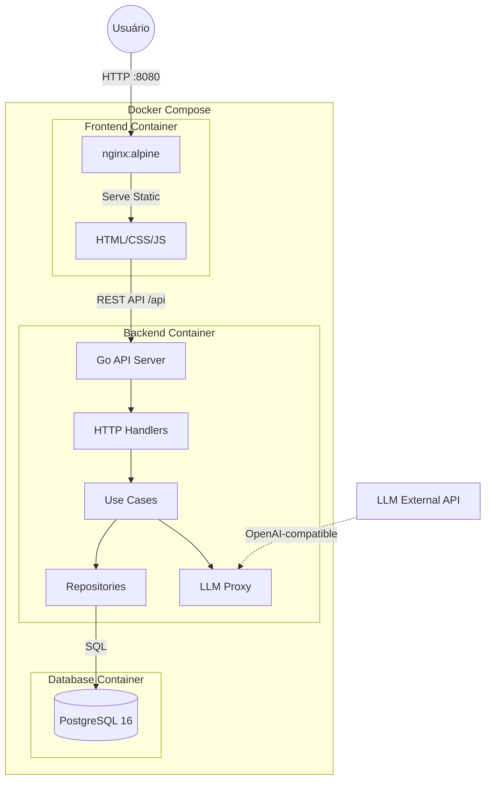

## 2.2 Decisões Arquiteturais

### ADR-001: Clean Architecture no Backend

**Motivação**: Separar responsabilidades para facilitar testes, manutenção e evolução.

**Alternativas consideradas**:
1. ~~Flat structure (handlers + DB)~~ — Rápido de implementar, mas difícil de testar e evoluir
2. ~~Hexagonal Architecture~~ — Mais complexo que o necessário para um projeto pessoal
3. **Clean Architecture (escolhida)** — Equilíbrio entre organização e simplicidade

**Impactos**:
- **Técnico**: Mais arquivos, mais interfaces, mas cada um com responsabilidade clara
- **Manutenção**: Alta facilidade de localizar e corrigir bugs
- **Performance**: Nenhum overhead mensurável
- **Escalabilidade**: Adição de novos módulos sem tocar no existente

### ADR-002: Cálculos Permanecem no Frontend

**Motivação**: Evitar latência de rede para operações de renderização que precisam ser instantâneas (score, summaries, gráficos). O backend apenas persiste e valida dados.

**Alternativas consideradas**:
1. ~~Todos os cálculos no backend~~ — Latência inaceitável em cada mudança de mês/ano
2. ~~Cálculos duplicados (front + back)~~ — Risco de divergência, manutenção dobrada
3. **Cálculos no frontend, validação no backend (escolhida)** — Preserva UX atual, backend garante integridade

**Impactos**:
- **Técnico**: Frontend precisa ter os dados carregados; backend não precisa replicar `engine.js`
- **Manutenção**: Uma fonte de verdade para cálculos (frontend), uma para dados (backend)
- **Performance**: Renderização instantânea sem round-trips
- **Escalabilidade**: Cálculos server-side podem ser adicionados futuramente (ex: relatórios agendados)

### ADR-003: API REST com JSON

**Motivação**: Simplicidade, compatibilidade universal, facilidade de debug.

**Alternativas consideradas**:
1. ~~GraphQL~~ — Overhead desnecessário para este domínio
2. ~~gRPC~~ — Não compatível nativamente com navegadores sem proxy
3. **REST + JSON (escolhida)** — Máxima simplicidade e debugging via DevTools

### ADR-004: Sem Autenticação na V1

**Motivação**: O sistema é pessoal. A autenticação será preparada estruturalmente (middleware placeholder, campo `user_id` no schema) mas não implementada.

**Impactos**:
- **Segurança**: Sistema acessível apenas via localhost ou rede local
- **Escalabilidade**: Schema já preparado para multi-tenant

### ADR-005: Nginx como Reverse Proxy

**Motivação**: Servir arquivos estáticos com eficiência e proxy API requests para o backend Go.

**Alternativas consideradas**:
1. ~~Go servindo frontend~~ — Mistura responsabilidades, requer rebuild Go para CSS changes
2. **Nginx (escolhida)** — Otimizado para estáticos, proxy reverso nativo, SPA routing

### ADR-006: LLM Proxy no Backend (Decisão OQ-1)

**Motivação**: Proteger API keys, centralizar logs de uso da LLM, preparar para rate limiting.

**Alternativas consideradas**:
1. ~~Chamadas diretas do frontend~~ — API keys expostas no navegador
2. **Proxy via backend Go (escolhida)** — Keys ficam em variáveis de ambiente do servidor

**Implementação**:
- Backend recebe o payload da mensagem + contexto financeiro do frontend
- Backend lê o prompt template do disco (`prompts/*.md`)
- Backend monta a requisição com a API key (env var) e envia para a LLM
- Backend retorna a resposta ao frontend
- Os 8 pontos de fetch para LLM no frontend serão substituídos por chamadas para `/api/v1/llm/*`

**Impactos**:
- **Segurança**: API keys nunca saem do servidor
- **Logging**: Todas as chamadas LLM são logadas com request_id
- **Performance**: Overhead adicional de ~5ms por chamada (irrelevante para chamadas LLM que demoram segundos)
- **Manutenção**: Prompts continuam como arquivos `.md` no backend, fáceis de editar

### ADR-007: Fotos de Metas Híbridas (Decisão OQ-2)

**Motivação**: Flexibilidade para os dois fluxos de upload existentes.

**Implementação**:
- **Upload de arquivo (drag & drop ou file input)**: Salvo em disco no volume Docker `uploads/metas/` como arquivo físico. Campo `foto` no banco contém o path relativo (ex: `/uploads/metas/{uuid}.jpg`)
- **URL externa**: Salvo diretamente no campo `foto` do PostgreSQL como `TEXT` (ex: `https://example.com/image.jpg`)
- O frontend distingue pelo prefixo: se começa com `/uploads/` → imagem servida pelo backend; senão → URL externa
- Backend serve arquivos estáticos de `/uploads/` via handler dedicado

**Impactos**:
- **Storage**: Volume Docker dedicado para uploads
- **Performance**: Imagens locais servidas rapidamente; URLs externas dependem da rede
- **Backup**: Volume `uploads` incluído na estratégia de backup

---

## 2.3 Árvore de Diretórios do Backend

```
saude-financeira-api/
├── cmd/
│   └── server/
│       └── main.go                  # Entry point
├── internal/
│   ├── domain/                      # Entidades e regras de domínio (innermost layer)
│   │   ├── entity/
│   │   │   ├── perfil.go
│   │   │   ├── despesa.go
│   │   │   ├── financiamento.go
│   │   │   ├── meta.go
│   │   │   ├── categoria.go
│   │   │   ├── planejamento.go
│   │   │   └── llm_config.go
│   │   ├── repository/              # Interfaces de repositório (ports)
│   │   │   ├── perfil_repository.go
│   │   │   ├── despesa_repository.go
│   │   │   ├── financiamento_repository.go
│   │   │   ├── meta_repository.go
│   │   │   ├── categoria_repository.go
│   │   │   ├── planejamento_repository.go
│   │   │   ├── settings_repository.go
│   │   │   └── migration_repository.go
│   │   └── errors/
│   │       └── domain_errors.go     # Erros tipados do domínio
│   ├── application/                 # Casos de uso (application layer)
│   │   ├── usecase/
│   │   │   ├── perfil_usecase.go
│   │   │   ├── despesa_usecase.go
│   │   │   ├── financiamento_usecase.go
│   │   │   ├── meta_usecase.go
│   │   │   ├── categoria_usecase.go
│   │   │   ├── planejamento_usecase.go
│   │   │   ├── settings_usecase.go
│   │   │   ├── csv_usecase.go
│   │   │   ├── llm_usecase.go
│   │   │   └── migration_usecase.go
│   │   └── dto/
│   │       ├── perfil_dto.go
│   │       ├── despesa_dto.go
│   │       ├── financiamento_dto.go
│   │       ├── meta_dto.go
│   │       ├── categoria_dto.go
│   │       ├── planejamento_dto.go
│   │       ├── settings_dto.go
│   │       ├── llm_dto.go
│   │       ├── csv_dto.go
│   │       └── response.go         # Envelope padrão de resposta
│   └── infrastructure/             # Implementações concretas (outermost layer)
│       ├── http/
│       │   ├── router.go           # Setup de rotas
│       │   ├── middleware/
│       │   │   ├── cors.go
│       │   │   ├── logging.go
│       │   │   ├── recovery.go
│       │   │   ├── request_id.go
│       │   │   └── auth_placeholder.go
│       │   └── handler/
│       │       ├── perfil_handler.go
│       │       ├── despesa_handler.go
│       │       ├── financiamento_handler.go
│       │       ├── meta_handler.go
│       │       ├── categoria_handler.go
│       │       ├── planejamento_handler.go
│       │       ├── settings_handler.go
│       │       ├── csv_handler.go
│       │       ├── llm_handler.go
│       │       ├── upload_handler.go
│       │       ├── migration_handler.go
│       │       └── health_handler.go
│       ├── persistence/
│       │   └── postgres/
│       │       ├── connection.go
│       │       ├── perfil_postgres.go
│       │       ├── despesa_postgres.go
│       │       ├── financiamento_postgres.go
│       │       ├── meta_postgres.go
│       │       ├── categoria_postgres.go
│       │       ├── planejamento_postgres.go
│       │       ├── settings_postgres.go
│       │       └── migration_postgres.go
│       ├── llm/
│       │   └── client.go           # HTTP client para LLM externa
│       ├── storage/
│       │   └── disk.go             # Upload de arquivos para disco
│       └── config/
│           └── config.go           # Configuração via env vars
├── pkg/
│   ├── validator/
│   │   └── validator.go            # Validações compartilhadas
│   └── logger/
│       └── logger.go               # Logging estruturado
├── migrations/
│   ├── 001_create_perfis.up.sql
│   ├── 001_create_perfis.down.sql
│   ├── 002_create_categorias.up.sql
│   ├── 002_create_categorias.down.sql
│   ├── 003_create_financiamentos.up.sql
│   ├── 003_create_financiamentos.down.sql
│   ├── 004_create_despesas.up.sql
│   ├── 004_create_despesas.down.sql
│   ├── 005_create_metas.up.sql
│   ├── 005_create_metas.down.sql
│   ├── 006_create_planejamento.up.sql
│   ├── 006_create_planejamento.down.sql
│   ├── 007_create_settings.up.sql
│   ├── 007_create_settings.down.sql
│   ├── 008_seed_defaults.up.sql
│   └── 008_seed_defaults.down.sql
├── prompts/                         # Templates de prompts LLM (copiados do frontend)
│   ├── agente.md
│   ├── ajustar_meta.md
│   ├── analise.md
│   ├── analise_investimentos.md
│   ├── importacao.md
│   ├── metodo_personalizado.md
│   ├── plano_amortizacao.md
│   └── plano_economia.md
├── uploads/                         # Volume Docker para fotos de metas
│   └── metas/
├── scripts/
│   ├── migrate.sh
│   └── seed.sh
├── docs/
│   └── api.md
├── Dockerfile
├── docker-compose.yml
├── go.mod
├── go.sum
├── .env.example
└── Makefile
```

## 2.4 Responsabilidades de Cada Camada

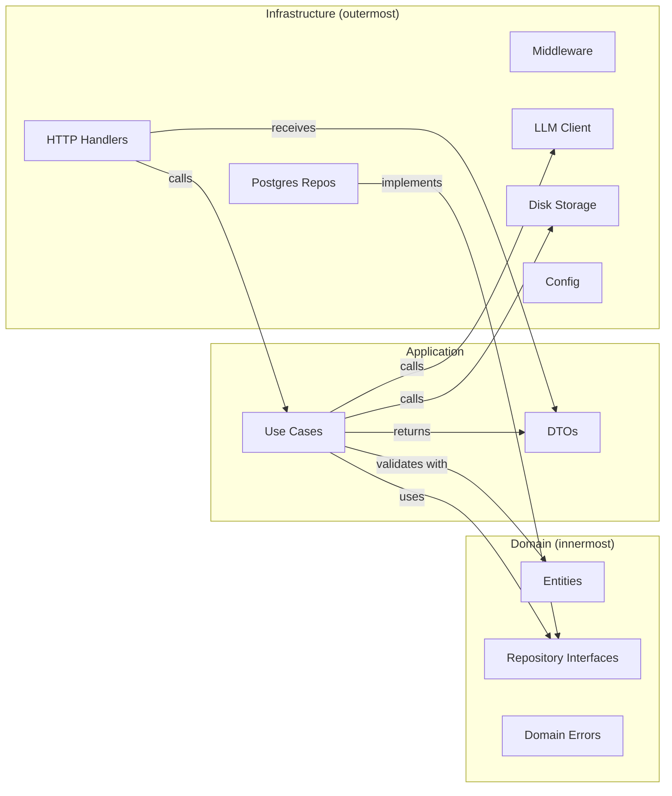

| Camada | Responsabilidade | Dependências |
|--------|-----------------|-------------|
| **Domain** | Entidades com validação intrínseca, interfaces de repositório, erros de domínio | Nenhuma (zero imports externos) |
| **Application** | Orquestração de casos de uso, conversão DTO↔Entity, regras de negócio cross-entity | Domain |
| **Infrastructure** | HTTP handlers, PostgreSQL repos, LLM client, disk storage, config, middleware, logging | Application + Domain |

---

# Fase 3 — Modelagem do Banco de Dados

## 3.1 Schema Relacional Completo

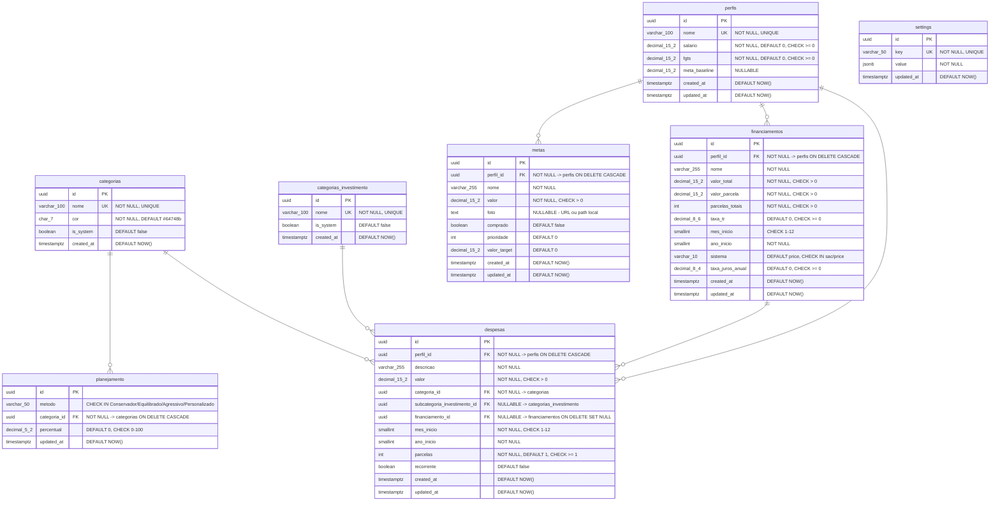

## 3.2 DDL Detalhado

### Migration 001 — Perfis

```sql
-- 001_create_perfis.up.sql
CREATE TABLE IF NOT EXISTS perfis (
    id UUID PRIMARY KEY DEFAULT gen_random_uuid(),
    nome VARCHAR(100) NOT NULL,
    salario DECIMAL(15, 2) NOT NULL DEFAULT 0 CHECK (salario >= 0),
    fgts DECIMAL(15, 2) NOT NULL DEFAULT 0 CHECK (fgts >= 0),
    meta_baseline DECIMAL(15, 2),
    created_at TIMESTAMPTZ NOT NULL DEFAULT NOW(),
    updated_at TIMESTAMPTZ NOT NULL DEFAULT NOW(),
    CONSTRAINT uq_perfis_nome UNIQUE (nome)
);

CREATE INDEX idx_perfis_nome ON perfis (nome);

CREATE OR REPLACE FUNCTION update_updated_at_column()
RETURNS TRIGGER AS $$
BEGIN
    NEW.updated_at = NOW();
    RETURN NEW;
END;
$$ LANGUAGE plpgsql;

CREATE TRIGGER trg_perfis_updated_at
    BEFORE UPDATE ON perfis
    FOR EACH ROW
    EXECUTE FUNCTION update_updated_at_column();
```

```sql
-- 001_create_perfis.down.sql
DROP TRIGGER IF EXISTS trg_perfis_updated_at ON perfis;
DROP TABLE IF EXISTS perfis;
```

### Migration 002 — Categorias

```sql
-- 002_create_categorias.up.sql
CREATE TABLE IF NOT EXISTS categorias (
    id UUID PRIMARY KEY DEFAULT gen_random_uuid(),
    nome VARCHAR(100) NOT NULL,
    cor CHAR(7) NOT NULL DEFAULT '#64748b' CHECK (cor ~ '^#[0-9A-Fa-f]{6}$'),
    is_system BOOLEAN NOT NULL DEFAULT false,
    created_at TIMESTAMPTZ NOT NULL DEFAULT NOW(),
    CONSTRAINT uq_categorias_nome UNIQUE (nome)
);

CREATE TABLE IF NOT EXISTS categorias_investimento (
    id UUID PRIMARY KEY DEFAULT gen_random_uuid(),
    nome VARCHAR(100) NOT NULL,
    is_system BOOLEAN NOT NULL DEFAULT false,
    created_at TIMESTAMPTZ NOT NULL DEFAULT NOW(),
    CONSTRAINT uq_cat_inv_nome UNIQUE (nome)
);

CREATE INDEX idx_categorias_nome ON categorias (nome);
CREATE INDEX idx_cat_inv_nome ON categorias_investimento (nome);
```

```sql
-- 002_create_categorias.down.sql
DROP TABLE IF EXISTS categorias_investimento;
DROP TABLE IF EXISTS categorias;
```

### Migration 003 — Financiamentos (antes de despesas por FK)

```sql
-- 003_create_financiamentos.up.sql
CREATE TABLE IF NOT EXISTS financiamentos (
    id UUID PRIMARY KEY DEFAULT gen_random_uuid(),
    perfil_id UUID NOT NULL REFERENCES perfis(id) ON DELETE CASCADE,
    nome VARCHAR(255) NOT NULL,
    valor_total DECIMAL(15, 2) NOT NULL CHECK (valor_total > 0),
    valor_parcela DECIMAL(15, 2) NOT NULL CHECK (valor_parcela > 0),
    parcelas_totais INTEGER NOT NULL CHECK (parcelas_totais > 0),
    taxa_tr DECIMAL(8, 6) NOT NULL DEFAULT 0 CHECK (taxa_tr >= 0),
    mes_inicio SMALLINT NOT NULL CHECK (mes_inicio BETWEEN 1 AND 12),
    ano_inicio SMALLINT NOT NULL,
    sistema VARCHAR(10) NOT NULL DEFAULT 'price' CHECK (sistema IN ('sac', 'price')),
    taxa_juros_anual DECIMAL(8, 4) NOT NULL DEFAULT 0 CHECK (taxa_juros_anual >= 0),
    created_at TIMESTAMPTZ NOT NULL DEFAULT NOW(),
    updated_at TIMESTAMPTZ NOT NULL DEFAULT NOW()
);

CREATE INDEX idx_financiamentos_perfil ON financiamentos (perfil_id);

CREATE TRIGGER trg_financiamentos_updated_at
    BEFORE UPDATE ON financiamentos
    FOR EACH ROW
    EXECUTE FUNCTION update_updated_at_column();
```

### Migration 004 — Despesas

```sql
-- 004_create_despesas.up.sql
CREATE TABLE IF NOT EXISTS despesas (
    id UUID PRIMARY KEY DEFAULT gen_random_uuid(),
    perfil_id UUID NOT NULL REFERENCES perfis(id) ON DELETE CASCADE,
    descricao VARCHAR(255) NOT NULL,
    valor DECIMAL(15, 2) NOT NULL CHECK (valor > 0),
    categoria_id UUID NOT NULL REFERENCES categorias(id),
    subcategoria_investimento_id UUID REFERENCES categorias_investimento(id) ON DELETE SET NULL,
    financiamento_id UUID REFERENCES financiamentos(id) ON DELETE SET NULL,
    mes_inicio SMALLINT NOT NULL CHECK (mes_inicio BETWEEN 1 AND 12),
    ano_inicio SMALLINT NOT NULL,
    parcelas INTEGER NOT NULL DEFAULT 1 CHECK (parcelas >= 1),
    recorrente BOOLEAN NOT NULL DEFAULT false,
    created_at TIMESTAMPTZ NOT NULL DEFAULT NOW(),
    updated_at TIMESTAMPTZ NOT NULL DEFAULT NOW()
);

CREATE INDEX idx_despesas_perfil ON despesas (perfil_id);
CREATE INDEX idx_despesas_categoria ON despesas (categoria_id);
CREATE INDEX idx_despesas_perfil_periodo ON despesas (perfil_id, ano_inicio, mes_inicio);
CREATE INDEX idx_despesas_financiamento ON despesas (financiamento_id) WHERE financiamento_id IS NOT NULL;

CREATE TRIGGER trg_despesas_updated_at
    BEFORE UPDATE ON despesas
    FOR EACH ROW
    EXECUTE FUNCTION update_updated_at_column();
```

### Migration 005 — Metas

```sql
-- 005_create_metas.up.sql
CREATE TABLE IF NOT EXISTS metas (
    id UUID PRIMARY KEY DEFAULT gen_random_uuid(),
    perfil_id UUID NOT NULL REFERENCES perfis(id) ON DELETE CASCADE,
    nome VARCHAR(255) NOT NULL,
    valor DECIMAL(15, 2) NOT NULL CHECK (valor > 0),
    foto TEXT,  -- URL externa ou path local (/uploads/metas/uuid.ext)
    comprado BOOLEAN NOT NULL DEFAULT false,
    prioridade INTEGER NOT NULL DEFAULT 0,
    valor_target DECIMAL(15, 2) NOT NULL DEFAULT 0,
    created_at TIMESTAMPTZ NOT NULL DEFAULT NOW(),
    updated_at TIMESTAMPTZ NOT NULL DEFAULT NOW()
);

CREATE INDEX idx_metas_perfil ON metas (perfil_id);
CREATE INDEX idx_metas_perfil_prioridade ON metas (perfil_id, prioridade) WHERE NOT comprado;

CREATE TRIGGER trg_metas_updated_at
    BEFORE UPDATE ON metas
    FOR EACH ROW
    EXECUTE FUNCTION update_updated_at_column();
```

### Migration 006 — Planejamento

```sql
-- 006_create_planejamento.up.sql
CREATE TABLE IF NOT EXISTS planejamento (
    id UUID PRIMARY KEY DEFAULT gen_random_uuid(),
    metodo VARCHAR(50) NOT NULL CHECK (metodo IN ('Conservador', 'Equilibrado', 'Agressivo', 'Personalizado')),
    categoria_id UUID NOT NULL REFERENCES categorias(id) ON DELETE CASCADE,
    percentual DECIMAL(5, 2) NOT NULL DEFAULT 0 CHECK (percentual >= 0 AND percentual <= 100),
    updated_at TIMESTAMPTZ NOT NULL DEFAULT NOW(),
    CONSTRAINT uq_planejamento_metodo_cat UNIQUE (metodo, categoria_id)
);

CREATE INDEX idx_planejamento_metodo ON planejamento (metodo);

CREATE TRIGGER trg_planejamento_updated_at
    BEFORE UPDATE ON planejamento
    FOR EACH ROW
    EXECUTE FUNCTION update_updated_at_column();
```

### Migration 007 — Settings

```sql
-- 007_create_settings.up.sql
CREATE TABLE IF NOT EXISTS settings (
    id UUID PRIMARY KEY DEFAULT gen_random_uuid(),
    key VARCHAR(50) NOT NULL,
    value JSONB NOT NULL DEFAULT '{}',
    updated_at TIMESTAMPTZ NOT NULL DEFAULT NOW(),
    CONSTRAINT uq_settings_key UNIQUE (key)
);

CREATE TRIGGER trg_settings_updated_at
    BEFORE UPDATE ON settings
    FOR EACH ROW
    EXECUTE FUNCTION update_updated_at_column();
```

### Migration 008 — Seed de Dados Padrão

```sql
-- 008_seed_defaults.up.sql

-- Categorias padrão
INSERT INTO categorias (nome, cor, is_system) VALUES
    ('Saúde', '#10b981', true),
    ('Alimentação', '#0ea5e9', true),
    ('Moradia', '#6366f1', true),
    ('Cartão de Crédito', '#f59e0b', true),
    ('Lazer', '#f43f5e', true),
    ('Serviços por Assinatura', '#8b5cf6', true),
    ('Serviços', '#14b8a6', true),
    ('Financiamento', '#d946ef', true),
    ('Amortização', '#06b6d4', true),
    ('Outros', '#64748b', true),
    ('Investimento', '#eab308', true)
ON CONFLICT (nome) DO NOTHING;

-- Subcategorias de investimento padrão
INSERT INTO categorias_investimento (nome, is_system) VALUES
    ('CDB', true), ('Previdência', true), ('Fundos', true),
    ('Ações', true), ('Poupança', true), ('FGTS', true), ('Outros', true)
ON CONFLICT (nome) DO NOTHING;

-- Planejamento padrão (todos os métodos)
INSERT INTO planejamento (metodo, categoria_id, percentual)
SELECT 'Conservador', c.id, v.pct FROM (VALUES
    ('Saúde',8),('Alimentação',18),('Moradia',30),('Lazer',5),('Cartão de Crédito',8),
    ('Serviços por Assinatura',2),('Serviços',9),('Investimento',20),
    ('Financiamento',0),('Outros',0),('Amortização',0)
) AS v(cat, pct) JOIN categorias c ON c.nome = v.cat
ON CONFLICT (metodo, categoria_id) DO NOTHING;

INSERT INTO planejamento (metodo, categoria_id, percentual)
SELECT 'Equilibrado', c.id, v.pct FROM (VALUES
    ('Saúde',7),('Alimentação',18),('Moradia',28),('Lazer',10),('Cartão de Crédito',10),
    ('Serviços por Assinatura',2),('Serviços',10),('Investimento',15),
    ('Financiamento',0),('Outros',0),('Amortização',0)
) AS v(cat, pct) JOIN categorias c ON c.nome = v.cat
ON CONFLICT (metodo, categoria_id) DO NOTHING;

INSERT INTO planejamento (metodo, categoria_id, percentual)
SELECT 'Agressivo', c.id, v.pct FROM (VALUES
    ('Saúde',6),('Alimentação',17),('Moradia',25),('Lazer',7),('Cartão de Crédito',8),
    ('Serviços por Assinatura',2),('Serviços',10),('Investimento',25),
    ('Financiamento',0),('Outros',0),('Amortização',0)
) AS v(cat, pct) JOIN categorias c ON c.nome = v.cat
ON CONFLICT (metodo, categoria_id) DO NOTHING;

-- Settings padrão
INSERT INTO settings (key, value) VALUES
    ('theme', '"dark"'),
    ('ultimo_backup', 'null'),
    ('llm_config', '{"apiUrl":"","apiKey":"","model":"","maxContext":10240}')
ON CONFLICT (key) DO NOTHING;
```

## 3.3 Justificativa das Decisões do Schema

| Decisão | Justificativa |
|---------|---------------|
| UUID como PK | Geração client-side possível, sem colisão, preparado para multi-tenant |
| Categorias como tabela | Referência normalizada, evita strings duplicadas, permite cores e flags |
| `is_system` em categorias | Protege categorias padrão contra deleção acidental |
| `ON DELETE CASCADE` em perfil→despesas/financ/metas | Replica o comportamento atual de `removerPerfil()` |
| `ON DELETE SET NULL` em financiamento→despesas | Preserva a despesa de amortização mesmo se o financiamento for removido |
| Índice composto `(perfil_id, ano_inicio, mes_inicio)` | Otimiza a query principal do sistema: despesas de um perfil em um mês/ano |
| Planejamento como tabela relacional | Evita JSON aninhado, permite queries e constraints por percentual |
| Settings como key-value JSONB | Flexibilidade para dados heterogêneos (theme string, llm_config object) |
| `DECIMAL(15,2)` para valores monetários | Evita erros de ponto flutuante, suporta valores até trilhões |
| Trigger `update_updated_at` | Auditoria automática sem lógica na aplicação |
| `foto TEXT` em metas | Armazena URL externa ou path local; backend distingue pelo prefixo |

## 3.4 Índices e Performance

| Índice | Tabela | Tipo | Justificativa |
|--------|--------|------|---------------|
| `idx_perfis_nome` | perfis | B-tree | Busca por nome (login futuro, CSV import) |
| `idx_despesas_perfil` | despesas | B-tree | Filtro principal: despesas de um perfil |
| `idx_despesas_perfil_periodo` | despesas | B-tree composto | Query de mês: `WHERE perfil_id = ? AND ano_inicio = ? AND mes_inicio = ?` |
| `idx_despesas_categoria` | despesas | B-tree | Relatórios por categoria |
| `idx_despesas_financiamento` | despesas | B-tree parcial | Amortizações (WHERE NOT NULL) |
| `idx_financiamentos_perfil` | financiamentos | B-tree | Filtro por perfil |
| `idx_metas_perfil` | metas | B-tree | Filtro por perfil |
| `idx_metas_perfil_prioridade` | metas | B-tree parcial | Ordenação de metas ativas |
| `idx_planejamento_metodo` | planejamento | B-tree | Query por método |

---

# Fase 4 — Arquitetura do Backend

## 4.1 Entidades de Domínio

Cada entidade contém validação intrínseca via método `Validate() error`:

```
Perfil {
    ID            uuid.UUID
    Nome          string      // NOT EMPTY, max 100 chars
    Salario       float64     // >= 0
    FGTS          float64     // >= 0
    MetaBaseline  *float64    // nullable
    CreatedAt     time.Time
    UpdatedAt     time.Time
}

Despesa {
    ID                         uuid.UUID
    PerfilID                   uuid.UUID
    Descricao                  string    // NOT EMPTY, max 255
    Valor                      float64   // > 0
    CategoriaID                uuid.UUID
    SubcategoriaInvestimentoID *uuid.UUID // nullable
    FinanciamentoID            *uuid.UUID // nullable
    MesInicio                  int       // 1-12
    AnoInicio                  int
    Parcelas                   int       // >= 1
    Recorrente                 bool
    CreatedAt                  time.Time
    UpdatedAt                  time.Time
}

Financiamento {
    ID              uuid.UUID
    PerfilID        uuid.UUID
    Nome            string    // NOT EMPTY, max 255
    ValorTotal      float64   // > 0
    ValorParcela    float64   // > 0
    ParcelasTotais  int       // > 0
    TaxaTR          float64   // >= 0
    MesInicio       int       // 1-12
    AnoInicio       int
    Sistema         string    // "sac" | "price"
    TaxaJurosAnual  float64   // >= 0
    CreatedAt       time.Time
    UpdatedAt       time.Time
}

Meta {
    ID          uuid.UUID
    PerfilID    uuid.UUID
    Nome        string    // NOT EMPTY, max 255
    Valor       float64   // > 0
    Foto        *string   // nullable — URL externa ou "/uploads/metas/{uuid}.ext"
    Comprado    bool
    Prioridade  int       // >= 0
    ValorTarget float64   // >= 0
    CreatedAt   time.Time
    UpdatedAt   time.Time
}
```

## 4.2 Interfaces de Repositório

```go
type PerfilRepository interface {
    Create(ctx context.Context, perfil *entity.Perfil) error
    GetByID(ctx context.Context, id uuid.UUID) (*entity.Perfil, error)
    GetByNome(ctx context.Context, nome string) (*entity.Perfil, error)
    GetAll(ctx context.Context) ([]*entity.Perfil, error)
    Update(ctx context.Context, perfil *entity.Perfil) error
    Delete(ctx context.Context, id uuid.UUID) error
}

type DespesaRepository interface {
    Create(ctx context.Context, despesa *entity.Despesa) error
    GetByID(ctx context.Context, id uuid.UUID) (*entity.Despesa, error)
    GetByPerfil(ctx context.Context, perfilID uuid.UUID) ([]*entity.Despesa, error)
    Update(ctx context.Context, despesa *entity.Despesa) error
    Delete(ctx context.Context, id uuid.UUID) error
    DeleteByPerfil(ctx context.Context, perfilID uuid.UUID) error
    BulkCreate(ctx context.Context, despesas []*entity.Despesa) error
}

type FinanciamentoRepository interface {
    Create(ctx context.Context, financiamento *entity.Financiamento) error
    GetByID(ctx context.Context, id uuid.UUID) (*entity.Financiamento, error)
    GetByPerfil(ctx context.Context, perfilID uuid.UUID) ([]*entity.Financiamento, error)
    Update(ctx context.Context, financiamento *entity.Financiamento) error
    Delete(ctx context.Context, id uuid.UUID) error
    DeleteByPerfil(ctx context.Context, perfilID uuid.UUID) error
}

type MetaRepository interface {
    Create(ctx context.Context, meta *entity.Meta) error
    GetByID(ctx context.Context, id uuid.UUID) (*entity.Meta, error)
    GetByPerfil(ctx context.Context, perfilID uuid.UUID) ([]*entity.Meta, error)
    Update(ctx context.Context, meta *entity.Meta) error
    Delete(ctx context.Context, id uuid.UUID) error
    BulkUpdatePrioridades(ctx context.Context, updates []MetaPrioridadeUpdate) error
    BulkUpdateTargets(ctx context.Context, updates []MetaTargetUpdate) error
}

type CategoriaRepository interface {
    Create(ctx context.Context, categoria *entity.Categoria) error
    GetAll(ctx context.Context) ([]*entity.Categoria, error)
    GetByNome(ctx context.Context, nome string) (*entity.Categoria, error)
    UpdateCor(ctx context.Context, id uuid.UUID, cor string) error
}

type SettingsRepository interface {
    Get(ctx context.Context, key string) (json.RawMessage, error)
    Set(ctx context.Context, key string, value json.RawMessage) error
    GetAll(ctx context.Context) (map[string]json.RawMessage, error)
}
```

## 4.3 Casos de Uso

| Use Case | Descrição | Regras |
|----------|-----------|--------|
| `CreatePerfil` | Cria novo perfil | Nome unique (case-insensitive), salário >= 0 |
| `DeletePerfil` | Remove perfil + cascade | DB cascade deleta despesas, financiamentos, metas |
| `UpdateSalario` | Atualiza salário do perfil | Valor >= 0 |
| `UpdateFGTS` | Atualiza FGTS do perfil | Valor >= 0 |
| `CreateDespesa` | Cria despesa | Validação completa de campos, vinculação opcional a financiamento |
| `UpdateDespesa` | Atualiza despesa por ID | Mesmas validações do create |
| `DeleteDespesa` | Remove despesa por ID | Verifica existência |
| `GetDespesasByPerfil` | Lista despesas de um perfil | Retorna com nomes de categoria/subcategoria |
| `BulkCreateDespesas` | Cria múltiplas (PDF import) | Transação atômica |
| `CreateFinanciamento` | Cria financiamento | Validações numéricas, sistema sac/price |
| `UpdateFinanciamento` | Atualiza financiamento | Parcelas, TR, sistema, juros |
| `DeleteFinanciamento` | Remove financiamento | SET NULL nas despesas vinculadas (DB) |
| `CreateMeta` | Cria meta (com upload ou URL) | Prioridade auto-calculada, recalcula targets |
| `DeleteMeta` | Remove meta + arquivo de foto se houver | Reordena prioridades, recalcula targets |
| `ReorderMetas` | Reordena prioridades | Aceita array de IDs ordenados |
| `ComprarMeta` | Marca meta como comprada | Ajusta metaBaseline do perfil |
| `UpdateMetaTargets` | Atualiza targets via LLM | Aceita array de {id, valorTarget} |
| `CreateCategoria` | Cria categoria custom | Nome unique, cor hex válida |
| `UpdateCorCategoria` | Atualiza cor da categoria | Formato #RRGGBB |
| `GetPlanejamento` | Retorna limites por método | Join com categorias para nomes |
| `UpdatePlanejamento` | Atualiza % de um método | Soma não pode exceder 100% |
| `GetSettings` | Retorna todas as settings | Inclui theme, llmConfig, ultimoBackup |
| `UpdateSetting` | Atualiza uma setting | Chave deve existir |
| `ExportCSV` | Gera CSV de um perfil | Formato compatível com sistema atual |
| `ImportCSV` | Importa CSV incremental | Upsert por perfil, merge inteligente |
| `ProxyLLM` | Proxy de chamada para LLM externa | Lê prompt, monta request, faz forward |
| `UploadMetaFoto` | Upload de imagem para disco | Salva em `/uploads/metas/{uuid}.ext` |
| `GetFullState` | Retorna estado completo | Para hidratação inicial do frontend |

## 4.4 DTOs

### Request DTOs

```
CreatePerfilRequest    { nome: string, salario: float64 }
UpdateSalarioRequest   { salario: float64 }
UpdateFGTSRequest      { fgts: float64 }

CreateDespesaRequest   { descricao, valor, categoria, subcategoria?, financiamentoId?,
                          mes_inicio, ano_inicio, parcelas, recorrente }
UpdateDespesaRequest   { (mesmos campos) }
BulkCreateDespesasReq  { despesas: []CreateDespesaRequest }

CreateFinanciamentoReq { nome, valorTotal, valorParcela, parcelasTotais, taxaTR,
                          mes_inicio, ano_inicio, sistema, taxaJurosAnual }
UpdateFinanciamentoReq { parcelasTotais, taxaTR, sistema, taxaJurosAnual }

CreateMetaRequest      { nome, valor, foto_url? }  // foto_url OU upload multipart
ReorderMetasRequest    { ids: []uuid }
UpdateMetaTargetsReq   { reajustes: []{ id: uuid, valorTarget: float64 } }

CreateCategoriaRequest { nome, cor }
UpdateCorRequest       { cor }

UpdatePlanejamentoReq  { metodo, limites: map[string]float64 }
UpdateSettingRequest   { value: any }

LLMProxyRequest        { prompt_name: string, context: object, messages?: []object }
```

### Response DTO (Envelope padrão)

```
APIResponse {
    success: boolean
    data:    any
    error:   { code: string, message: string }?
    meta:    { total: int, page: int }?
}
```

## 4.5 LLM Proxy — Detalhamento

### Fluxo do proxy

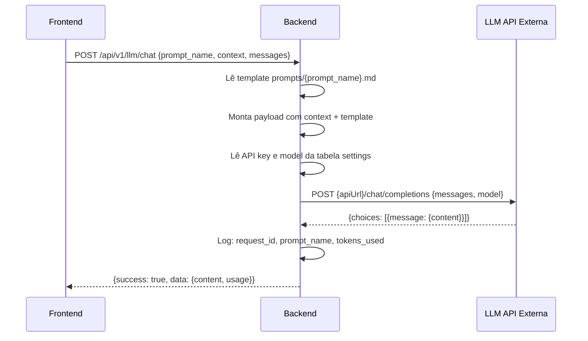

### Endpoints LLM

| Endpoint | Prompt | Uso |
|----------|--------|-----|
| `POST /api/v1/llm/chat` | `agente.md` | Chat com agente financeiro |
| `POST /api/v1/llm/analyze` | `analise.md` | Análise financeira |
| `POST /api/v1/llm/savings-plan` | `plano_economia.md` | Plano de economia |
| `POST /api/v1/llm/investments` | `analise_investimentos.md` | Análise de investimentos |
| `POST /api/v1/llm/amortization` | `plano_amortizacao.md` | Plano de amortização |
| `POST /api/v1/llm/custom-method` | `metodo_personalizado.md` | Método personalizado |
| `POST /api/v1/llm/adjust-goals` | `ajustar_meta.md` | Ajuste de metas |
| `POST /api/v1/llm/parse-invoice` | `importacao.md` | Parse de fatura PDF |

### Variáveis de ambiente LLM

```env
# LLM config fica no banco (settings table), mas pode ser overridden por env:
LLM_API_URL=        # Override da URL da API LLM
LLM_API_KEY=        # Override da API key (mais seguro que salvar no banco)
LLM_MODEL=          # Override do modelo
LLM_MAX_CONTEXT=    # Override do max context
```

Prioridade: env var > settings no banco > vazio (erro).

## 4.6 Upload de Fotos — Detalhamento

### Fluxo de upload

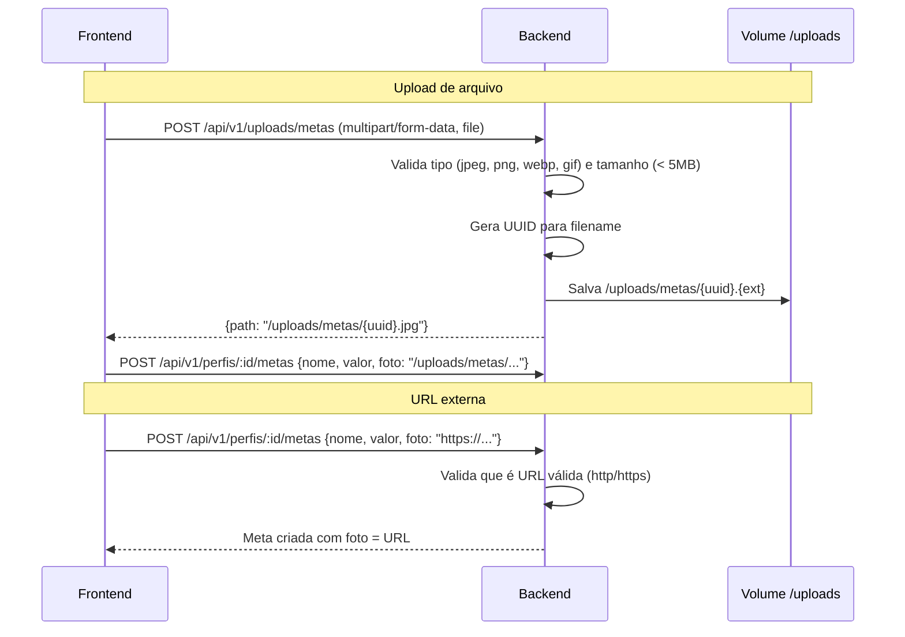

### Servindo uploads

O backend serve arquivos estáticos:
```
GET /uploads/metas/{filename} → lê de /app/uploads/metas/{filename}
```

O Nginx proxia `/uploads/` para o backend, ou serve diretamente do volume compartilhado.

## 4.7 Tratamento de Erros

```
Erros de Domínio (→ HTTP Status):
├── ErrNotFound           → 404 Not Found
├── ErrAlreadyExists      → 409 Conflict
├── ErrValidation         → 422 Unprocessable Entity
├── ErrInvalidInput       → 400 Bad Request
├── ErrForbidden          → 403 Forbidden (futuro)
├── ErrUnauthorized       → 401 Unauthorized (futuro)
├── ErrLLMUnavailable     → 502 Bad Gateway (LLM externa down)
├── ErrLLMTimeout         → 504 Gateway Timeout
└── ErrInternal           → 500 Internal Server Error
```

## 4.8 Logging

- **Biblioteca**: `log/slog` (stdlib Go 1.21+)
- **Formato**: JSON estruturado
- **Campos**: `timestamp`, `level`, `msg`, `request_id`, `method`, `path`, `status`, `duration_ms`, `error`
- **Campos extras LLM**: `prompt_name`, `llm_model`, `tokens_used`, `llm_duration_ms`
- **Níveis**: `DEBUG` (dev), `INFO` (prod), `WARN`, `ERROR`

## 4.9 Configuração

| Variável | Default | Descrição |
|----------|---------|-----------|
| `SERVER_PORT` | `8081` | Porta do servidor HTTP |
| `DATABASE_URL` | — | Connection string PostgreSQL |
| `DB_MAX_OPEN_CONNS` | `25` | Pool: max conexões abertas |
| `DB_MAX_IDLE_CONNS` | `5` | Pool: max conexões idle |
| `DB_CONN_MAX_LIFETIME` | `5m` | Pool: tempo máximo de vida |
| `LOG_LEVEL` | `info` | Nível de log |
| `CORS_ORIGINS` | `http://localhost:8080` | Origens permitidas |
| `MIGRATIONS_PATH` | `./migrations` | Caminho das migrations |
| `AUTO_MIGRATE` | `true` | Executar migrations no startup |
| `UPLOADS_PATH` | `./uploads` | Diretório de uploads |
| `MAX_UPLOAD_SIZE` | `5242880` | Tamanho máximo de upload (5MB) |
| `LLM_API_URL` | — | Override URL da LLM |
| `LLM_API_KEY` | — | Override API key da LLM |
| `LLM_MODEL` | — | Override modelo da LLM |
| `LLM_MAX_CONTEXT` | `10240` | Override max context |
| `LLM_TIMEOUT` | `120s` | Timeout para chamadas LLM |

## 4.10 Estratégia de Migrations

- **Ferramenta**: `golang-migrate/migrate` (v4)
- **Execução**: Automática no startup do container (se `AUTO_MIGRATE=true`)
- **Versionamento**: Sequencial numérica (`001_`, `002_`, etc.)
- **Cada migration**: Par de arquivos `.up.sql` / `.down.sql`
- **Idempotência**: `IF NOT EXISTS` / `ON CONFLICT DO NOTHING` em seed

---

# Fase 5 — Arquitetura do Frontend

## 5.1 Estratégia de Substituição

O frontend mantém **100% da sua estrutura visual e lógica de renderização**. Mudanças:

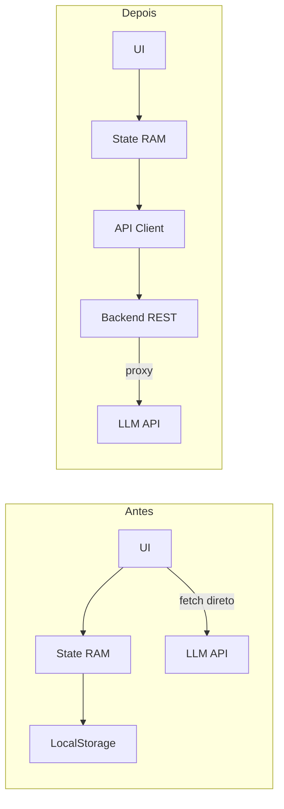

### Arquivo novo: `js/api-client.js`

Responsabilidades:
- Substituir `storage.js` como camada de persistência
- Encapsular todos os `fetch()` para a API REST
- Encapsular chamadas LLM via proxy backend
- Implementar retry com backoff exponencial
- Cache local com `sessionStorage` para dados estáticos
- Indicador de sync (Salvando... / Salvo ✓ / Erro ✗)

### Mudanças em `storage.js`

Refatorado (não removido):
1. Mantém `convertToCSV()` e `parseFromCSV()` para compatibilidade
2. `saveToLocalStorage()` → chamada ao API client
3. `loadFromLocalStorage()` → `GET /api/v1/state`
4. Mantém fallback LocalStorage durante loading

### Mudanças em `app.js`

```
Antes:  State.subscribe(Storage.saveToLocalStorage)
Depois: State.subscribe(APIClient.syncToBackend)
```

### Mudanças em `state.js`

Cada mutação → optimistic update local + sync assíncrono com API.

### Mudanças em `ui-agent.js`

Os 8 pontos de `fetch(config.apiUrl + "/chat/completions")` serão substituídos por:
```javascript
// Antes:
const response = await fetch(`${config.apiUrl}/chat/completions`, { ... });

// Depois:
const response = await window.App.APIClient.llm("chat", { context, messages });
```

Os 8 pontos de `fetch("prompts/*.md")` serão removidos — prompts ficam no backend.

### Mudanças em `ui-metas.js`

- `fetch("prompts/ajustar_meta.md")` → removido
- `fetch(config.apiUrl + "/chat/completions")` → `APIClient.llm("adjust-goals", {...})`
- Upload de foto: se `File` → `APIClient.uploadMetaFoto(file)` → recebe path
- Se URL → passa diretamente no campo `foto`

## 5.2 API Client (`js/api-client.js`)

```
APIClient {
    baseURL: string     // "/api/v1" (mesmo origin via nginx proxy)

    // Perfis
    getPerfis(): Promise<Perfil[]>
    createPerfil(data): Promise<Perfil>
    deletePerfil(id): Promise<void>
    updateSalario(id, salario): Promise<void>
    updateFGTS(id, fgts): Promise<void>

    // Despesas
    getDespesasByPerfil(perfilId): Promise<Despesa[]>
    createDespesa(perfilId, data): Promise<Despesa>
    updateDespesa(id, data): Promise<Despesa>
    deleteDespesa(id): Promise<void>
    bulkCreateDespesas(perfilId, data): Promise<Despesa[]>

    // Financiamentos
    getFinanciamentosByPerfil(perfilId): Promise<Financiamento[]>
    createFinanciamento(perfilId, data): Promise<Financiamento>
    updateFinanciamento(id, data): Promise<Financiamento>
    deleteFinanciamento(id): Promise<void>

    // Metas
    getMetasByPerfil(perfilId): Promise<Meta[]>
    createMeta(perfilId, data): Promise<Meta>
    deleteMeta(id): Promise<void>
    reorderMetas(perfilId, ids): Promise<void>
    comprarMeta(id): Promise<void>
    updateMetaTargets(perfilId, reajustes): Promise<void>

    // Uploads
    uploadMetaFoto(file): Promise<{path: string}>

    // Categorias
    getCategorias(): Promise<Categoria[]>
    createCategoria(data): Promise<Categoria>
    updateCorCategoria(id, cor): Promise<void>
    getCategoriasInvestimento(): Promise<CategoriaInvestimento[]>
    createCategoriaInvestimento(data): Promise<CategoriaInvestimento>

    // Planejamento
    getPlanejamento(): Promise<Planejamento>
    updatePlanejamento(metodo, limites): Promise<void>

    // Settings
    getSettings(): Promise<Settings>
    updateSetting(key, value): Promise<void>

    // CSV
    exportCSV(perfilId): Promise<string>
    importCSV(file): Promise<ImportResult>

    // LLM (proxy)
    llm(endpoint, payload): Promise<LLMResponse>

    // Estado completo
    getFullState(): Promise<AppState>

    // Migração
    migrateFromLocalStorage(stateJSON): Promise<MigrationResult>

    // Internals
    _fetch(method, path, body?): Promise<any>
    _retryWithBackoff(fn, maxRetries): Promise<any>
}
```

## 5.3 Gerenciamento de Estado Pós-Refatoração

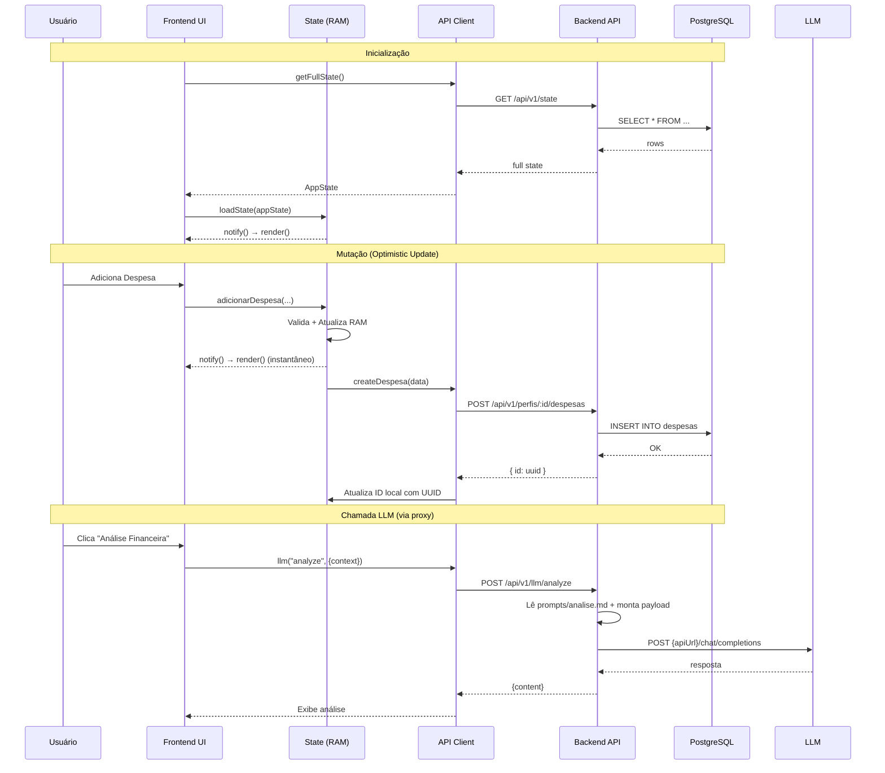

## 5.4 Cache e Sincronização

| Estratégia | Implementação |
|-----------|---------------|
| Cache de leitura | `sessionStorage` com TTL 5min para categorias, settings |
| Optimistic updates | Mutação local + sync async com backend |
| Debounce de escrita | Edições inline (salário, FGTS) debounced 500ms |
| Loading states | Skeleton apenas na hidratação inicial; CRUD instantâneo |
| Indicador de sync | Badge "Salvando..." / "Salvo ✓" / "Erro ✗" no header |

## 5.5 Tratamento de Erros

```
├── Erro de rede (offline)     → Toast: "Sem conexão. Alterações salvas localmente."
├── Erro de validação (422)    → Toast com mensagem do servidor
├── Erro de conflito (409)     → Toast: "Registro já existe."
├── Erro LLM (502/504)        → Toast: "LLM indisponível. Verifique a configuração."
├── Erro interno (500)         → Toast: "Erro no servidor. Tente novamente."
└── Timeout (> 10s)            → Retry automático com backoff
```

---

# Fase 6 — Especificação Completa da API REST

## 6.1 Convenções

| Item | Convenção |
|------|-----------|
| Base URL | `/api/v1` |
| Formato | JSON (`Content-Type: application/json`) |
| IDs | UUID v4 |
| Timestamps | ISO 8601 (`2026-01-15T10:30:00Z`) |
| Valores monetários | `float64` (2 casas decimais) |
| Envelope | `{ "success": bool, "data": any, "error": { "code": string, "message": string } }` |

## 6.2 Perfis

| Método | Endpoint | Objetivo | Body | Sucesso | Erros |
|--------|----------|----------|------|---------|-------|
| GET | `/perfis` | Listar todos | — | 200 | — |
| POST | `/perfis` | Criar | `{nome, salario}` | 201 | 409, 422 |
| PUT | `/perfis/:id/salario` | Atualizar salário | `{salario}` | 200 | 404, 422 |
| PUT | `/perfis/:id/fgts` | Atualizar FGTS | `{fgts}` | 200 | 404, 422 |
| DELETE | `/perfis/:id` | Remover (cascade) | — | 204 | 404 |

## 6.3 Despesas

| Método | Endpoint | Objetivo | Body | Sucesso | Erros |
|--------|----------|----------|------|---------|-------|
| GET | `/perfis/:pid/despesas` | Listar por perfil | — | 200 | 404 |
| POST | `/perfis/:pid/despesas` | Criar | `{descricao, valor, categoria, ...}` | 201 | 404, 422 |
| POST | `/perfis/:pid/despesas/bulk` | Criar em lote | `{despesas: [...]}` | 201 | 422 |
| PUT | `/despesas/:id` | Atualizar | `{descricao, valor, ...}` | 200 | 404, 422 |
| DELETE | `/despesas/:id` | Remover | — | 204 | 404 |

## 6.4 Financiamentos

| Método | Endpoint | Objetivo | Body | Sucesso | Erros |
|--------|----------|----------|------|---------|-------|
| GET | `/perfis/:pid/financiamentos` | Listar | — | 200 | 404 |
| POST | `/perfis/:pid/financiamentos` | Criar | `{nome, valorTotal, ...}` | 201 | 404, 422 |
| PUT | `/financiamentos/:id` | Atualizar | `{parcelasTotais, taxaTR, ...}` | 200 | 404, 422 |
| DELETE | `/financiamentos/:id` | Remover | — | 204 | 404 |

## 6.5 Metas

| Método | Endpoint | Objetivo | Body | Sucesso | Erros |
|--------|----------|----------|------|---------|-------|
| GET | `/perfis/:pid/metas` | Listar (por prioridade) | — | 200 | 404 |
| POST | `/perfis/:pid/metas` | Criar | `{nome, valor, foto?}` | 201 | 404, 422 |
| PUT | `/metas/:id/comprar` | Comprar | — | 200 | 404 |
| PUT | `/perfis/:pid/metas/reorder` | Reordenar | `{ids: [...]}` | 200 | 422 |
| PUT | `/perfis/:pid/metas/targets` | Atualizar targets | `{reajustes: [...]}` | 200 | 422 |
| DELETE | `/metas/:id` | Remover | — | 204 | 404 |

## 6.6 Uploads

| Método | Endpoint | Objetivo | Body | Sucesso | Erros |
|--------|----------|----------|------|---------|-------|
| POST | `/uploads/metas` | Upload foto | `multipart/form-data` | 201 | 413, 422 |
| GET | `/uploads/metas/:filename` | Servir foto | — | 200 | 404 |

## 6.7 Categorias

| Método | Endpoint | Objetivo | Body | Sucesso | Erros |
|--------|----------|----------|------|---------|-------|
| GET | `/categorias` | Listar | — | 200 | — |
| POST | `/categorias` | Criar | `{nome, cor}` | 201 | 409, 422 |
| PUT | `/categorias/:id/cor` | Atualizar cor | `{cor}` | 200 | 404, 422 |
| GET | `/categorias-investimento` | Listar subcategorias | — | 200 | — |
| POST | `/categorias-investimento` | Criar subcategoria | `{nome}` | 201 | 409, 422 |

## 6.8 Planejamento

| Método | Endpoint | Objetivo | Body | Sucesso | Erros |
|--------|----------|----------|------|---------|-------|
| GET | `/planejamento` | Retornar todos | — | 200 | — |
| PUT | `/planejamento/:metodo` | Atualizar limites | `{limites: {...}}` | 200 | 422 |

## 6.9 Settings

| Método | Endpoint | Objetivo | Body | Sucesso | Erros |
|--------|----------|----------|------|---------|-------|
| GET | `/settings` | Retornar todas | — | 200 | — |
| PUT | `/settings/:key` | Atualizar | `{value: any}` | 200 | 404 |

## 6.10 CSV

| Método | Endpoint | Objetivo | Body | Sucesso | Erros |
|--------|----------|----------|------|---------|-------|
| GET | `/perfis/:pid/csv/export` | Exportar CSV | — | 200 text/csv | 404 |
| POST | `/csv/import` | Importar CSV | `multipart/form-data` | 200 | 422 |

## 6.11 LLM Proxy

| Método | Endpoint | Prompt Template | Body |
|--------|----------|----------------|------|
| POST | `/llm/chat` | `agente.md` | `{context, messages}` |
| POST | `/llm/analyze` | `analise.md` | `{context}` |
| POST | `/llm/savings-plan` | `plano_economia.md` | `{context}` |
| POST | `/llm/investments` | `analise_investimentos.md` | `{context}` |
| POST | `/llm/amortization` | `plano_amortizacao.md` | `{context}` |
| POST | `/llm/custom-method` | `metodo_personalizado.md` | `{context}` |
| POST | `/llm/adjust-goals` | `ajustar_meta.md` | `{context}` |
| POST | `/llm/parse-invoice` | `importacao.md` | `{text}` |

Todos retornam: `{ success: true, data: { content: string, usage: { prompt_tokens, completion_tokens } } }`

Erros: `502` LLM indisponível, `504` timeout, `422` contexto inválido, `400` LLM não configurada

## 6.12 Estado e Health

| Método | Endpoint | Objetivo | Sucesso |
|--------|----------|----------|---------|
| GET | `/state` | Estado completo (hidratação) | 200 |
| GET | `/health` | Health check | 200 |
| GET | `/health/ready` | Readiness probe | 200 / 503 |
| POST | `/migration/import-state` | Migrar LocalStorage | 200 |

---

# Fase 7 — Plano de Migração

## 7.1 Estratégia

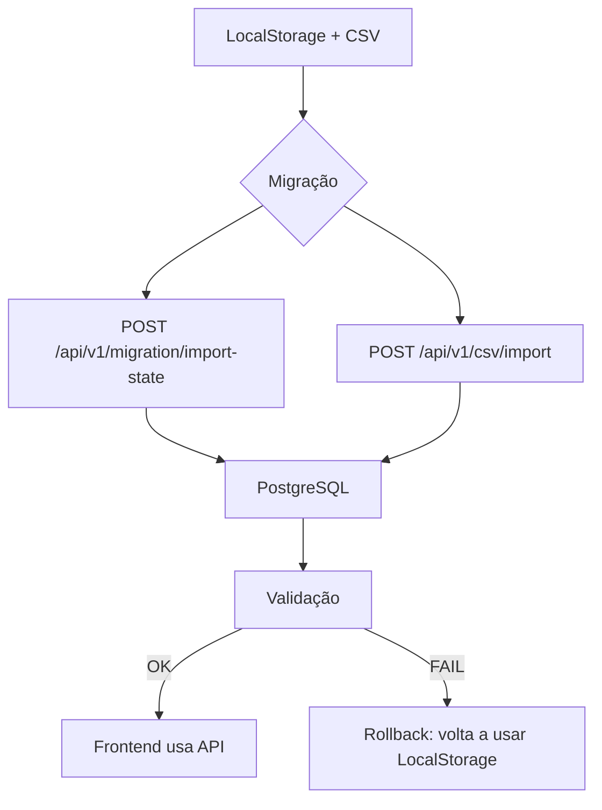

## 7.2 Endpoint de Migração: `POST /api/v1/migration/import-state`

Recebe o JSON completo do LocalStorage. O backend:
1. Desserializa o JSON
2. Cria perfis (nome → UUID)
3. Cria categorias (merge com padrões)
4. Cria financiamentos (old_id → new_uuid)
5. Cria despesas (resolve FK: categoria string → categoria_id, financiamentoId string → uuid)
6. Cria metas (preserva prioridade e targets)
7. Importa planejamento
8. Importa settings (theme, llmConfig, ultimoBackup)

Tudo dentro de uma transação SQL. Se falhar, ROLLBACK completo.

## 7.3 Fotos de metas na migração

Fotos que são `data:image/...` (base64):
- Backend decodifica o base64
- Salva como arquivo em `/uploads/metas/{uuid}.{ext}`
- Armazena o path no banco

Fotos que são URLs externas:
- Armazena a URL diretamente no campo `foto`

## 7.4 Validação de Consistência

Após migração, o backend executa queries de validação e retorna relatório:
```json
{
  "perfis_migrados": 2,
  "despesas_migradas": 45,
  "financiamentos_migrados": 1,
  "metas_migradas": 5,
  "fotos_extraidas": 3,
  "categorias_migradas": 13,
  "orphans_detectados": 0,
  "validation_passed": true
}
```

## 7.5 Prevenção de Perda

1. Transação atômica — tudo ou nada
2. Idempotência — `ON CONFLICT` evita duplicatas
3. LocalStorage preservado — frontend não apaga após migração
4. Backup JSON — backend pode salvar o JSON recebido em disco antes de processar

## 7.6 Fluxo do Usuário

1. Abre app → detecta LocalStorage com dados + backend disponível
2. Exibe banner "Migrar dados para o servidor?"
3. Clica Migrar → envia JSON → exibe progresso → resultado
4. Passa a usar API para tudo
5. LocalStorage mantido como fallback

---

# Fase 8 — Docker Compose

## 8.1 Arquitetura

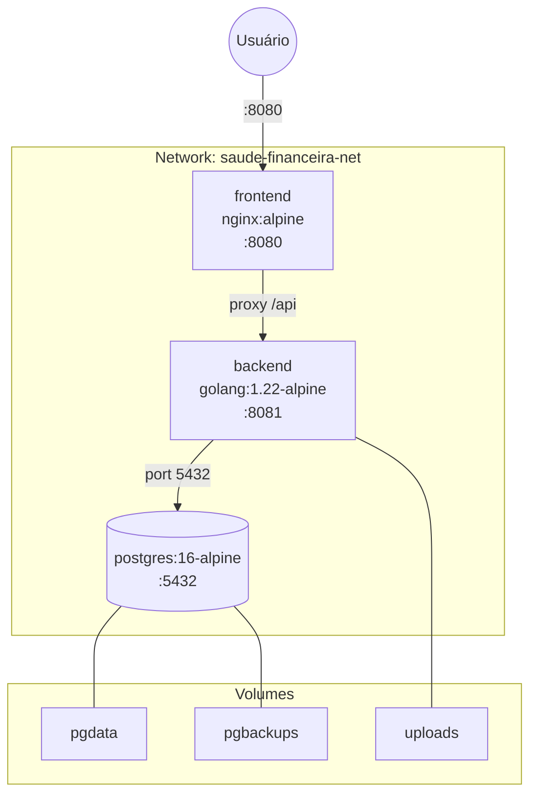

## 8.2 docker-compose.yml

```yaml
version: "3.9"

services:
  frontend:
    build: ./frontend
    container_name: saude-financeira-frontend
    ports: ["${FRONTEND_PORT:-8080}:80"]
    depends_on:
      backend: { condition: service_healthy }
    networks: [saude-financeira-net]
    restart: unless-stopped

  backend:
    build: ./backend
    container_name: saude-financeira-backend
    ports: ["${BACKEND_PORT:-8081}:8081"]
    environment:
      - SERVER_PORT=8081
      - DATABASE_URL=postgres://${DB_USER:-saude}:${DB_PASSWORD:-saude123}@postgres:5432/${DB_NAME:-saude_financeira}?sslmode=disable
      - LOG_LEVEL=${LOG_LEVEL:-info}
      - CORS_ORIGINS=http://localhost:${FRONTEND_PORT:-8080}
      - AUTO_MIGRATE=true
      - UPLOADS_PATH=/app/uploads
      - LLM_API_URL=${LLM_API_URL:-}
      - LLM_API_KEY=${LLM_API_KEY:-}
      - LLM_MODEL=${LLM_MODEL:-}
      - LLM_TIMEOUT=${LLM_TIMEOUT:-120s}
    volumes:
      - uploads:/app/uploads
    depends_on:
      postgres: { condition: service_healthy }
    networks: [saude-financeira-net]
    restart: unless-stopped
    healthcheck:
      test: ["CMD", "wget", "--spider", "-q", "http://localhost:8081/api/v1/health"]
      interval: 10s
      timeout: 5s
      retries: 5
      start_period: 15s

  postgres:
    image: postgres:16-alpine
    container_name: saude-financeira-db
    environment:
      POSTGRES_USER: ${DB_USER:-saude}
      POSTGRES_PASSWORD: ${DB_PASSWORD:-saude123}
      POSTGRES_DB: ${DB_NAME:-saude_financeira}
    volumes:
      - pgdata:/var/lib/postgresql/data
      - pgbackups:/backups
    ports: ["${DB_PORT:-5432}:5432"]
    networks: [saude-financeira-net]
    restart: unless-stopped
    healthcheck:
      test: ["CMD-SHELL", "pg_isready -U ${DB_USER:-saude}"]
      interval: 5s
      timeout: 3s
      retries: 10
      start_period: 10s

volumes:
  pgdata:
  pgbackups:
  uploads:

networks:
  saude-financeira-net:
    driver: bridge
```

## 8.3 nginx.conf atualizado

```nginx
server {
    listen 80;
    root /usr/share/nginx/html;
    index index.html;

    location / { try_files $uri $uri/ /index.html; }

    location /api/ {
        proxy_pass http://backend:8081;
        proxy_set_header Host $host;
        proxy_set_header X-Real-IP $remote_addr;
        proxy_set_header X-Forwarded-For $proxy_add_x_forwarded_for;
        proxy_set_header X-Request-ID $request_id;
        proxy_read_timeout 130s;  # LLM calls podem demorar
    }

    location /uploads/ {
        proxy_pass http://backend:8081;
    }

    gzip on;
    gzip_types text/plain text/css application/json application/javascript;
}
```

## 8.4 Backup e Restore

```bash
# Backup
docker exec saude-financeira-db pg_dump -U saude saude_financeira > backup.sql

# Restore
docker exec -i saude-financeira-db psql -U saude saude_financeira < backup.sql

# Backup de uploads
docker cp saude-financeira-backend:/app/uploads ./uploads-backup
```

---

# Fase 9 — Plano de Testes

## 9.1 Testes Unitários (Backend)

| Camada | Alvo | Mock |
|--------|------|------|
| Domain | `entity/*.Validate()` | Nenhum |
| Application | `usecase/*` | Repository interfaces |
| Infrastructure | `handler/*` | UseCase interfaces |

## 9.2 Testes de Integração

Usam `testcontainers-go` com PostgreSQL efêmero:
- Ciclo de vida CRUD completo por entidade
- Migração de estado completa
- Import CSV
- Upload de foto

## 9.3 Testes de API (E2E HTTP)

Usam `httptest` com servidor completo + DB real:
- Todos os endpoints com cenários de sucesso e erro
- LLM proxy com mock server

## 9.4 Testes de Banco

- Migrations up/down sem erro
- Constraints validadas
- Triggers funcionando
- Seed data presente
- Índices usados (EXPLAIN ANALYZE)

## 9.5 Testes de Regressão (Frontend)

Testes Vitest existentes continuam com mock do API Client.

## 9.6 Smoke Tests

Script bash que valida a stack completa pós-deploy.

## 9.7 Testes de Migração

- LocalStorage real → PostgreSQL com contagens
- CSV import com delimitadores diferentes
- Migração idempotente
- Fotos base64 extraídas corretamente

---

# Fase 10 — Roadmap de Implementação

## Etapa 1: Setup Go + Docker Base
- **Objetivo**: Estrutura do projeto, Dockerfile, docker-compose funcional
- **Arquivos**: `cmd/server/main.go`, `go.mod`, `Dockerfile`, `docker-compose.yml`, `config.go`, `logger.go`
- **Critério**: `docker compose up` inicia 3 containers, health check 200
- **Risco**: Baixo

## Etapa 2: Migrations e Schema
- **Objetivo**: Todas as 8 migrations + seeds
- **Dependência**: Etapa 1
- **Critério**: Tabelas criadas, seeds populados, down funciona
- **Risco**: Baixo

## Etapa 3: Domain Layer
- **Objetivo**: Entidades + interfaces + erros de domínio
- **Dependência**: Etapa 2
- **Critério**: `Validate()` com testes unitários, zero imports externos
- **Risco**: Baixo

## Etapa 4: Repositórios PostgreSQL
- **Objetivo**: Implementar todas as interfaces
- **Dependência**: Etapas 2, 3
- **Critério**: Testes de integração passam
- **Risco**: Médio

## Etapa 5: Use Cases
- **Objetivo**: Todos os casos de uso
- **Dependência**: Etapas 3, 4
- **Critério**: Testes unitários com mocks
- **Risco**: Médio (lógica de metas/baseline)

## Etapa 6: HTTP Layer + LLM Proxy + Uploads
- **Objetivo**: Handlers, middleware, router, LLM client, disk storage
- **Dependência**: Etapa 5
- **Critério**: Todos endpoints respondem, CORS ok, LLM proxy funciona
- **Risco**: Médio

## Etapa 7: Endpoint de Migração
- **Objetivo**: `POST /api/v1/migration/import-state`
- **Dependência**: Etapa 6
- **Critério**: Aceita JSON do LocalStorage, transação atômica, fotos extraídas
- **Risco**: Alto

## Etapa 8: Frontend — API Client + LLM Redirect
- **Objetivo**: `api-client.js`, modificar `app.js`, `storage.js`, `ui-agent.js`, `ui-metas.js`
- **Dependência**: Etapa 6
- **Critério**: Optimistic updates, retry, fallback LocalStorage, LLM via proxy
- **Risco**: Alto

## Etapa 9: Frontend — Fluxo de Migração
- **Objetivo**: Banner + lógica de migração no primeiro acesso
- **Dependência**: Etapas 7, 8
- **Critério**: Detecta dados, migra, valida, transiciona
- **Risco**: Médio

## Etapa 10: Nginx Proxy + Docker Compose Final
- **Objetivo**: nginx.conf com proxy reverso, volumes de uploads
- **Dependência**: Etapas 8, 9
- **Critério**: Stack completa funcional, smoke tests passam
- **Risco**: Baixo

## Etapa 11: Testes + Documentação
- **Objetivo**: Cobertura > 80%, smoke tests, README atualizado
- **Dependência**: Todas
- **Critério**: Todos os testes passam, documentação completa
- **Risco**: Baixo

---

# Segurança

| Prática | Implementação |
|---------|---------------|
| CORS | Middleware configurável, permite apenas frontend origin |
| SQL Injection | Prepared statements em todas as queries |
| LLM API Keys | Nunca expostas no frontend; ficam em env vars do backend |
| Validação | Dupla: frontend (UX) + backend (segurança) |
| Sanitização | Strings trimadas, números parseados, regex para hex |
| Upload validation | Tipo (jpeg/png/webp/gif), tamanho (< 5MB), nome sanitizado |
| Env vars | `.env` fora do git, `.env.example` versionado |
| Logs | Sem dados sensíveis, API keys mascaradas |
| Error handling | Erros internos nunca expostos ao cliente |
| Request ID | UUID por request para rastreabilidade |
| Recovery | Middleware de panic recovery |

---

# Performance

| Otimização | Detalhes |
|-----------|---------|
| Índices compostos | `(perfil_id, ano_inicio, mes_inicio)` |
| Connection pooling | max_open=25, max_idle=5, lifetime=5m |
| Cache | sessionStorage para categorias/settings (TTL 5min) |
| Gzip | Ativado no Nginx |
| Binary Go | `-ldflags="-s -w"` |
| Alpine images | < 50MB cada |
| Batch operations | BulkCreate para importação |
| LLM timeout | 120s configurável |
| Proxy timeout | Nginx proxy_read_timeout 130s para LLM |

---

# Convenções

| Contexto | Convenção | Exemplo |
|----------|-----------|---------|
| Go packages | lowercase, singular | `entity`, `usecase` |
| Go structs | PascalCase | `PerfilUseCase` |
| Go files | snake_case | `perfil_usecase.go` |
| SQL tables | snake_case, plural | `perfis`, `despesas` |
| SQL columns | snake_case | `valor_total` |
| API paths | kebab-case, plural | `/categorias-investimento` |
| JSON fields | snake_case | `"valor_total"` |
| Env vars | UPPER_SNAKE_CASE | `DATABASE_URL` |
| Docker containers | kebab-case | `saude-financeira-backend` |
| Uploads | UUID filename | `{uuid}.jpg` |

---

# Checklist Final

- [ ] Todas as funcionalidades mapeadas estão cobertas pela API
- [ ] Schema reflete 100% das entidades do estado atual
- [ ] Nenhuma regra de negócio perdida
- [ ] Frontend visualmente idêntico
- [ ] LLM proxy funcional com todas as 8 operações
- [ ] Upload de fotos híbrido (disco + URL)
- [ ] Migração testada e reversível
- [ ] Docker Compose funcional com `docker compose up`
- [ ] Testes unitários, integração e E2E
- [ ] API keys protegidas no backend
- [ ] CORS configurado
- [ ] SQL Injection impossível
- [ ] Graceful degradation (fallback LocalStorage)
- [ ] Observabilidade preparada
