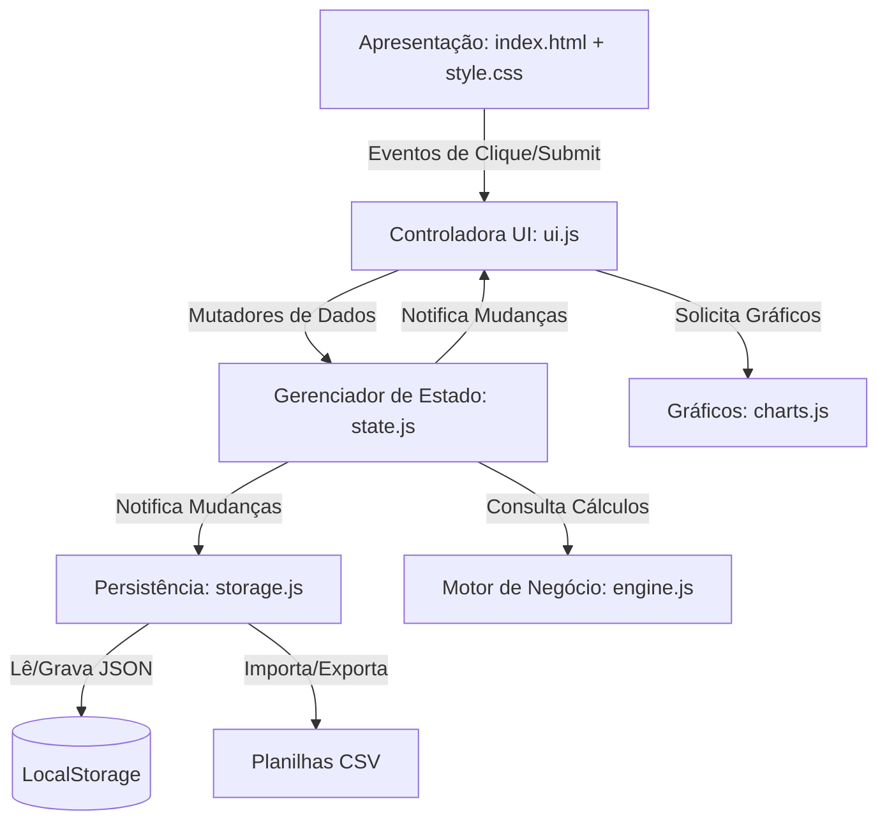
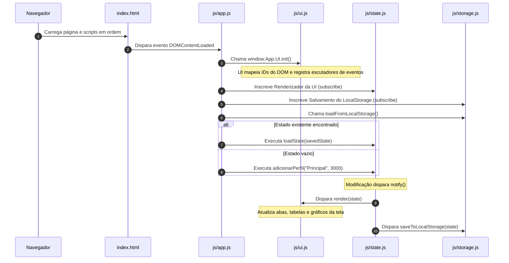
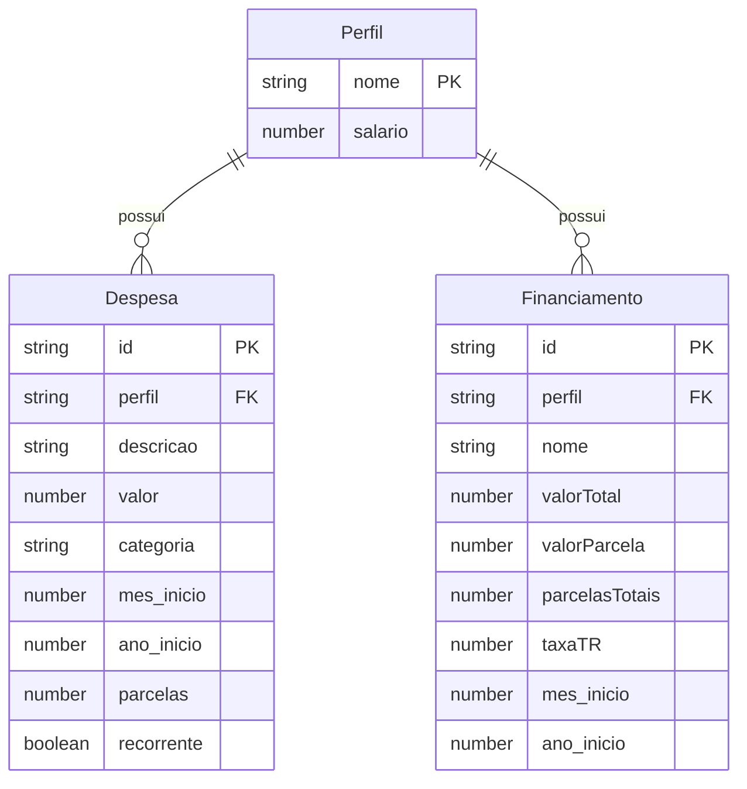
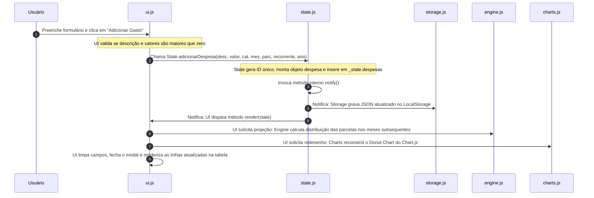

# Base de Conhecimento - Engenharia Reversa (Saúde Financeira)

Este documento apresenta uma análise técnica e de engenharia reversa completa do projeto **Saúde Financeira**, detalhando a stack tecnológica, arquitetura, fluxos de dados, estrutura de diretórios e padrões identificados no código.

---

## 1. Visão Geral

### Descrição e Objetivo
O **Saúde Financeira** é uma aplicação web de uso pessoal estritamente cliente (offline-first), projetada para rodar localmente no navegador a partir de uma estrutura de arquivos estáticos. O objetivo principal é permitir que o usuário gerencie seu orçamento doméstico, divida despesas recorrentes, calcule projeções financeiras e simule amortizações de contratos de financiamento a longo prazo sem enviar seus dados para servidores externos.

### Problema que Resolve
*   **Privacidade Financeira**: Elimina a necessidade de enviar dados bancários ou históricos de gastos pessoais para servidores na nuvem, mantendo todas as informações na sandbox de armazenamento local do navegador do próprio usuário.
*   **Projeção de Longo Prazo**: Automatiza a distribuição de despesas parceladas de cartões de crédito e financiamentos longos (como imobiliários) ao longo de múltiplos anos, facilitando o cálculo de saldo livre futuro.
*   **Simulação de Amortização**: Fornece um painel interativo de simulação SAC para prever economias reais com amortizações extras em financiamentos ativos.

### Principais Funcionalidades
*   **Múltiplos Perfis**: Cadastro, exclusão e transição entre diferentes perfis com salários bases independentes.
*   **Gerenciador Multi-Anual**: Abas dinâmicas de anos e meses geradas automaticamente a partir da abrangência temporal das despesas lançadas.
*   **Lançamentos Categorizados**: CRUD de despesas comuns e parceladas, incluindo classificação em tempo real e recorrência inteligente até o final do ano corrente.
*   **Painel de Financiamentos**: Visualização de progresso das parcelas, taxas referenciais (T.R.) e simulação SAC completa de amortizações extras com visualização de parcelas e juros economizados.
*   **Relatórios Interativos**: Gráficos de Pizza (divisão setorial de gastos) e de Linha (projeção acumulada mensal de gastos versus salário livre) renderizados sob demanda.
*   **Customização Dinâmica**: Cadastro de categorias, editor de paletas de cores em tempo real e comutador dinâmico de Modo Claro e Modo Escuro.
*   **Sincronização Física**: Exportação e importação seletiva de perfis completos através de planilhas CSV locais.

*Origem das Informações*:
*   [index.html](file:///c:/projetos/saude_financeira/index.html)
*   [js/app.js](file:///c:/projetos/saude_financeira/js/app.js)
*   [js/ui.js](file:///c:/projetos/saude_financeira/js/ui.js)

---

## 2. Stack Tecnológica

| Componente | Tecnologia | Versão Identificada | Observação |
| :--- | :--- | :--- | :--- |
| **Linguagem** | JavaScript | ECMAScript 2022 | Configurado no linter (`ecmaVersion: 2022`) |
| **Arquitetura Base** | Vanilla HTML5 / Vanilla JS | N/A | Sem frameworks pesados no client-side |
| **Estilização (CSS)** | Tailwind CSS | v3 (via CDN) | Auxiliado por estilos customizados locais |
| **Estilos Locais** | CSS Vanilla | N/A | [style.css](file:///c:/projetos/saude_financeira/css/style.css) para temas e modais |
| **Gráficos** | Chart.js | via CDN | Renderização de gráficos pizza e linha |
| **Runtime de Dev** | Node.js | v18+ recomendada | Requisitado para instalação de dependências |
| **Servidor de Dev** | lite-server | `^2.6.1` | Servidor web de recarga rápida (BrowserSync) |
| **Linter** | ESLint | `^9.0.0` | Validador estático do padrão de código |
| **Testes** | Vitest | `^1.6.0` | Framework de testes (configurado para execução) |
| **Persistência** | LocalStorage | N/A | Armazenamento nativo sob a chave `saude_financeira_db` |
| **Sincronização** | CSV | N/A | Serialização e parse nativos via delimitadores |

*Origem das Informações*:
*   [package.json](file:///c:/projetos/saude_financeira/package.json)
*   [eslint.config.js](file:///c:/projetos/saude_financeira/eslint.config.js)
*   [js/storage.js](file:///c:/projetos/saude_financeira/js/storage.js)

---

## 3. Arquitetura

A aplicação adota um padrão de **Single Page Application (SPA)** implementada puramente em JavaScript (Vanilla JS), estruturada com namespaces isolados auto-executáveis (**Module Pattern** usando funções IIFE).

### Padrões de Projeto Identificados
1.  **Observer Pattern (Padrão Observador)**: O gerenciador de estado central (`window.App.State`) atua como o sujeito observável. Componentes como o renderizador da UI (`window.App.UI`) e o motor de persistência (`window.App.Storage`) inscrevem-se como ouvintes e reagem instantaneamente a qualquer mutação do estado de dados.
2.  **Monólito Modular**: Os arquivos javascript dividem responsabilidades claras e comunicam-se de forma acíclica e unidirecional sob a árvore global `window.App`.
3.  **State Store Pattern**: Um objeto privado em memória (`_state`) guarda a verdade única da aplicação. Modificações de dados só podem ocorrer através de métodos públicos expostos e validados.

### Estrutura das Camadas de Responsabilidade



*   **Camada de Apresentação (View)**: HTML semântico e folha de estilos contendo transições e a sobreposição premium para o Modo Claro (`body.theme-light`).
*   **Camada Controladora (UI/Presenter)**: Interage com o DOM, valida dados de formulários antes de invocar o estado, atualiza tabelas, controla modais e dispara a renderização dos gráficos.
*   **Camada de Estado (Model/Store)**: Centraliza as mutações de perfis, despesas, financiamentos, categorias, cores e preferências de tema. Garante a reatividade da aplicação notificando os assinantes a cada modificação.
*   **Camada de Negócios (Engine)**: Desprovida de conhecimento sobre o DOM ou de persistência. Contém lógica matemática pura (SAC, juros, projeção de calendário e distribuição absoluta de parcelas).
*   **Camada de Persistência (Storage)**: Manipula o LocalStorage e realiza conversões bidirecionais entre CSV e objetos JSON nativos.

*Origem das Informações*:
*   [js/state.js](file:///c:/projetos/saude_financeira/js/state.js)
*   [js/ui.js](file:///c:/projetos/saude_financeira/js/ui.js)
*   [js/engine.js](file:///c:/projetos/saude_financeira/js/engine.js)

---

## 4. Estrutura de Diretórios

A estrutura física do projeto é compacta e organizada por extensões e responsabilidades:

```text
saude_financeira/
├── css/
│   └── style.css            # Estilização local complementar (temas e animações)
├── js/
│   ├── app.js               # Orquestrador inicial e ciclo de vida
│   ├── charts.js            # Abstração de desenho dos gráficos Chart.js
│   ├── engine.js            # Lógicas matemáticas e financeiras (SAC, parcelas)
│   ├── state.js             # Gerenciador de estado reativo (Observer/Store)
│   ├── storage.js           # Mecanismo de persistência LocalStorage e serialização CSV
│   └── ui.js                # Controladora de interface e escutadores de eventos do DOM
├── prompts/
│   ├── architecture.md      # Histórico e documentação da arquitetura
│   ├── dependencies.md      # Especificação das dependências
│   ├── history.md           # Registro histórico dos prompts executados
│   ├── index.md             # Índice geral de prompts de evolução
│   ├── manifesto.md         # Diretrizes do desenvolvimento
│   └── roadmap.md           # Cronograma de próximas etapas
├── docs/
│   └── knowledge_base.md    # Este documento (Base de Conhecimento)
├── CHANGELOG.md             # Histórico de alterações e lançamentos de versões
├── eslint.config.js         # Configurações do validador estático (ESLint 9)
├── index.html               # Arquivo principal (SPA / Ponto de Entrada)
├── package-lock.json        # Árvore de dependências trancada do npm
├── package.json             # Manifesto de dependências e scripts do projeto
└── README.md                # Instruções de instalação e visão de usuário
```

---

## 5. Bibliotecas Utilizadas

| Biblioteca | Versão | Origem | Finalidade | Local de Utilização |
| :--- | :---: | :---: | :--- | :--- |
| **Tailwind CSS** | v3 | CDN Script | Estilização rápida através de utilitários responsivos | [index.html](file:///c:/projetos/saude_financeira/index.html#L14) |
| **Chart.js** | via CDN | CDN Script | Desenho dos gráficos donut de divisão de categorias e linha de projeções | [index.html](file:///c:/projetos/saude_financeira/index.html#L15), [js/charts.js](file:///c:/projetos/saude_financeira/js/charts.js) |
| **lite-server** | `^2.6.1` | package.json | Servidor web de desenvolvimento com hot-reload local | [package.json](file:///c:/projetos/saude_financeira/package.json#L7) |
| **eslint** | `^9.0.0` | package.json | Ferramenta de linting para validação de regras de escrita | [package.json](file:///c:/projetos/saude_financeira/package.json#L8), [eslint.config.js](file:///c:/projetos/saude_financeira/eslint.config.js) |
| **vitest** | `^1.6.0` | package.json | Executor e executor de testes em JavaScript | [package.json](file:///c:/projetos/saude_financeira/package.json#L9) |

---

## 6. Fluxo da Aplicação

### Ciclo de Inicialização (Bootstrap)



1.  **Carregamento de Scripts**: O arquivo `index.html` carrega as dependências via CDN e, em seguida, os módulos locais. A ordem é crucial para evitar referências nulas: `storage.js` -> `state.js` -> `engine.js` -> `charts.js` -> `ui.js` -> `app.js`.
2.  **DOMContentLoaded**: Mapeado no `js/app.js`, age como orquestrador inicial.
3.  **UI Caching e Bindings**: `window.App.UI.init()` faz a busca de todos os nós relevantes do DOM por ID e registra ouvintes de eventos para cliques, seleções e submissões.
4.  **Assinatura de Eventos (Observer)**: A controladora registra dois observadores centrais no `State`:
    *   `window.App.UI.render(state)`: atualiza elementos, renderiza tabelas e chama desenhos de gráficos a cada mutação de dados.
    *   `window.App.Storage.saveToLocalStorage(state)`: grava automaticamente o novo estado no LocalStorage a cada alteração.
5.  **Descarregamento de Cache**: A aplicação tenta ler o LocalStorage. Se houver dados, o estado é atualizado (`loadState`); caso contrário, um perfil de testes com salário base padrão é provisionado automaticamente.

*Origem das Informações*:
*   [js/app.js](file:///c:/projetos/saude_financeira/js/app.js)
*   [js/ui.js](file:///c:/projetos/saude_financeira/js/ui.js#L240-L330)

---

## 7. Módulos

### Módulo `window.App.State` (`js/state.js`)
*   **Objetivo**: Controlar o estado mutável em memória e intermediar modificações de dados.
*   **Responsabilidades**: Mapeamento de perfis, controle da aba de ano e mês ativo, adição/edição de despesas, gerenciamento de financiamentos ativos, controle de categorias, cores e tema claro/escuro. Dispara as atualizações dos observadores através de `notify()`.
*   **Principais Funções**: `getState()`, `loadState()`, `adicionarPerfil()`, `removerPerfil()`, `adicionarDespesa()`, `removerDespesa()`, `adicionarFinanciamento()`, `adicionarCategoria()`, `atualizarCorCategoria()`, `toggleTheme()`.

### Módulo `window.App.UI` (`js/ui.js`)
*   **Objetivo**: Manipulação direta dos elementos do DOM, captura de eventos e interface com o usuário.
*   **Responsabilidades**: Gerenciar abertura e fechamento de modais (perfil, despesa, financiamento), preencher dados dinâmicos em tabelas, aplicar classes para destacar abas ativas, chamar desenho dos gráficos e atualizar os valores KPI do cabeçalho.
*   **Principais Funções**: `init()`, `render()`, `renderPerfis()`, `renderAnos()`, `renderAbas()`, `renderCategoriasDropdowns()`, `renderConfiguracoes()`.

### Módulo `window.App.Engine` (`js/engine.js`)
*   **Objetivo**: Lógica de cálculo puro de projeção temporal e matemática de financiamento.
*   **Responsabilidades**: Calcular amortização pelo sistema SAC com taxa TR e amortizações extraordinárias; projetar despesas acumuladas em cartões de crédito mês a mês; consolidar resumos mensais e anuais de gastos por categoria.
*   **Principais Funções**: `calculateMonthlySummary()`, `calculateAnnualSummary()`, `calculateCardProjection()`, `getInstallmentInfo()`, `calculateSACAmortization()`.

### Módulo `window.App.Storage` (`js/storage.js`)
*   **Objetivo**: Abstração de persistência no LocalStorage e conversões bidirecionais com arquivos CSV.
*   **Responsabilidades**: Gravar e ler strings JSON na chave `saude_financeira_db`; serializar despesas e financiamentos do perfil ativo para formato CSV; interpretar linhas CSV importadas respeitando aspas duplas, identificando e gerando objetos estruturados de perfil.
*   **Principais Funções**: `saveToLocalStorage()`, `loadFromLocalStorage()`, `convertToCSV()`, `parseFromCSV()`, `exportAsCSVFile()`.

### Módulo `window.App.Charts` (`js/charts.js`)
*   **Objetivo**: Ponte entre os dados processados pelo motor de negócio e a biblioteca externa Chart.js.
*   **Responsabilidades**: Destruir instâncias antigas de canvas para evitar erros de renderização e configurar e plotar gráficos de donut (categorias) e gráficos de linha (histórico anual).
*   **Principais Funções**: `renderPizzaChart()`, `renderLineChart()`.

*Origem das Informações*:
*   Diretório [js/](file:///c:/projetos/saude_financeira/js)

---

## 8. APIs

Não se aplica. O projeto funciona estritamente em ambiente cliente (offline/local) e não realiza chamadas de API ou requisições de rede.

---

## 9. Banco de Dados

### Estrutura de Armazenamento
O banco de dados é simulado no sandbox do navegador sob a chave `saude_financeira_db` do `LocalStorage`.

### Entidades e Relacionamentos



*   **Perfil**: Entidade pai. Chave primária lógica é o seu `nome` (string higienizada). Cada perfil tem um salário fixo.
*   **Despesa**: Entidade filha vinculada a um perfil através da propriedade `perfil`. Possui controle de recorrência anual e distribuição por parcelas.
*   **Financiamento**: Entidade filha vinculada a um perfil através da propriedade `perfil`. Contém as definições do contrato de parcelamento SAC e amortização.

*Origem das Informações*:
*   [js/state.js](file:///c:/projetos/saude_financeira/js/state.js#L5-L25)

---

## 10. Autenticação e Segurança

Não se aplica. Por ser uma ferramenta estritamente pessoal e local rodando no computador do usuário, não existem fluxos de autenticação, logins corporativos, geração de tokens JWT ou controle de sessões em servidores.

---

## 11. Configurações

Não existem arquivos `.env` ou variáveis de ambiente de produção para build. Toda a configuração é em nível de código (CDN Scripts no HTML) e no estado salvo no navegador:

*   **Chave LocalStorage**: `saude_financeira_db` (Definida no [js/storage.js](file:///c:/projetos/saude_financeira/js/storage.js#L5)).
*   **Categorias Padrão e Cores Iniciais**: Definidas na inicialização do estado em `js/state.js`:
    ```javascript
    categorias: {
      "Saúde": "#10b981",
      "Alimentação": "#0ea5e9",
      "Moradia": "#6366f1",
      "Cartão de Crédito": "#f59e0b",
      "Lazer": "#f43f5e",
      "Serviços por Assinatura": "#8b5cf6",
      "Serviços": "#14b8a6",
      "Financiamento": "#d946ef",
      "Outros": "#64748b"
    }
    ```

---

## 12. Execução do Projeto

### Pré-requisitos
*   **Node.js**: Versão 18.x ou superior instalada localmente (necessário para dev server).

### Instalação
1. Clone o repositório ou navegue até a pasta do projeto:
   ```bash
   cd c:/projetos/saude_financeira
   ```
2. Instale as dependências de desenvolvimento listadas no `package.json`:
   ```bash
   npm install
   ```

### Execução em Desenvolvimento (lite-server)
Para executar com recarga rápida no navegador a cada mudança de código (hot-reload):
```bash
npm run dev
```
O servidor será aberto automaticamente no endereço: `http://localhost:3000`.

### Execução em Produção / Standalone
Como não há etapa de compilação, para executar em produção basta servir os arquivos estáticos de qualquer servidor web (como Nginx ou Apache) ou abrir diretamente o arquivo `index.html` no navegador (protocolo `file:///` via clique duplo).

*Origem das Informações*:
*   [package.json](file:///c:/projetos/saude_financeira/package.json#L6-L10)
*   [README.md](file:///c:/projetos/saude_financeira/README.md#L24-L34)

---

## 13. Testes

### Framework de Testes
O framework configurado no projeto é o **Vitest**.

### Execução dos Testes
Para rodar a suíte de testes:
```bash
npm run test
```
*Nota*: Não foram encontrados arquivos de teste integrados de fábrica (como `.test.js` ou `.spec.js`) no diretório do projeto, embora o runner esteja pronto e as suítes de validação residam temporariamente na pasta de scratchpad/testes do ambiente de desenvolvimento.

---

## 14. Scripts

Todos os scripts definidos no manifesto do projeto:

| Comando | Execução | Finalidade |
| :--- | :--- | :--- |
| **`npm run dev`** | `lite-server` | Inicializa o servidor local de desenvolvimento com BrowserSync e abre a URL no navegador. |
| **`npm run lint`** | `eslint js/**/*.js` | Executa o ESLint 9 para checar conformidade estática e erros de sintaxe nos códigos javascript em `js/`. |
| **`npm run test`** | `vitest run` | Executa os testes unitários do vitest e finaliza o processo. |

*Origem das Informações*:
*   [package.json](file:///c:/projetos/saude_financeira/package.json#L6-L10)

---

## 15. Build e Deploy

### Processo de Build
Não há processo de compilação, empacotamento (bundling) ou transpilação (como Webpack, Vite ou Babel) configurado para a entrega do projeto.

### Processo de Deploy
O deploy consiste na transferência estática de arquivos:
*   Basta copiar os diretórios `css/`, `js/` e o arquivo `index.html` para qualquer bucket de nuvem (AWS S3, Vercel, Netlify, GitHub Pages) ou servidor estático.

---

## 16. Fluxo Geral de Dados

O diagrama abaixo ilustra o fluxo de dados em resposta ao cadastro de um novo gasto de cartão de crédito parcelado:



---

## 17. Dependências Externas

A aplicação é autossuficiente e possui apenas duas dependências de carregamento externo (CDNs) especificadas no cabeçalho do arquivo `index.html`:

1.  **Tailwind CSS (v3)**: Carregado via script CDN no cabeçalho da página para disponibilizar classes de utilitário.
    *   *URL de Origem*: `https://cdn.tailwindcss.com`
2.  **Chart.js**: Carregado via script CDN no cabeçalho da página para renderização de gráficos.
    *   *URL de Origem*: `https://cdn.jsdelivr.net/npm/chart.js`

---

## 18. Segurança

*   **Avanço Local**: O projeto não envia dados do usuário para servidores Web terceiros, reduzindo riscos de roubo ou vazamento de dados de natureza financeira.
*   **Tratamento de Entradas no CSV**: Na exportação do CSV, strings de perfil, descrição e categoria recebem escaping de aspas duplas (`"` substituída por `""` e envoltas em aspas) para evitar injeções ou corrupção de delimitadores na planilha.
*   **Tratamento Defensivo contra DOM Nulo**: Todos os acessos a elementos do DOM no `ui.js` contêm condicionais de existência (ex.: `if (kpiSaldo) { ... }`), prevenindo falhas fatais que bloqueiam o carregamento da aplicação em navegadores antigos ou ambientes de renderização incompletos.

*Origem das Informações*:
*   [js/storage.js](file:///c:/projetos/saude_financeira/js/storage.js#L78-L96)
*   [js/ui.js](file:///c:/projetos/saude_financeira/js/ui.js)

---

## 19. Observações Técnicas e Dívidas Técnicas

*   **Execução Direta do Tailwind CSS**: O uso de Tailwind via CDN diretamente em produção não é recomendado para projetos comerciais de grande escala devido ao overhead de interpretação de estilos em runtime no navegador.
*   **Mock de DOM nos Testes**: A falta de testes de integração acoplados ao DOM na raiz do projeto (Vitest sem JSDOM configurado no workspace original) impede validações completas de componentes de interface de forma integrada ao pipeline nativo de deploy.
*   **Uso Intensivo de Loops e Recálculo**: A cada ciclo de renderização, o motor financeiro recalcula dinamicamente toda a distribuição temporal de parcelas e recorrências. Embora seja ideal para manter o estado síncrono e leve no LocalStorage, pode apresentar degradação de performance caso o usuário lance milhares de despesas parceladas em horizontes de tempo de dezenas de anos.

---

## 20. Resumo Final

O **Saúde Financeira** é um sistema cliente offline modularizado, projetado sob os padrões estruturais do **Module Pattern (IIFE)** e **Observer Pattern** para garantir a independência de suas camadas (Apresentação, UI, Estado, Armazenamento e Gráficos). Construído puramente com **HTML5, CSS e Javascript moderno**, utiliza o armazenamento do próprio navegador (`LocalStorage`) e sincronização de dados por arquivos **CSV locais** como pilares de privacidade. O projeto é executado instantaneamente via `index.html` ou pelo servidor de desenvolvimento `lite-server` (BrowserSync), com validação estática de erros monitorada pelo `ESLint 9` e runner pronto para testes unitários com o `Vitest`.
